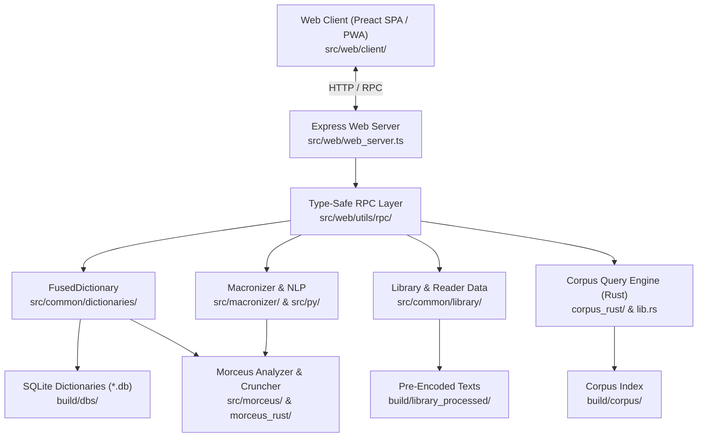

# Morcus.net Architecture Guide

This document provides a comprehensive architectural overview of Morcus.net to help developers and AI coding agents understand system boundaries, module interactions, data flows, and design conventions across the repository.

---

## 1. High-Level Overview

Morcus.net is an integrated digital platform and toolkit for Latin language study and research, providing:

- **Dictionary Search & Aggregation**: Fused multi-dictionary engine combining Latin-English, English-Latin, Latin-French, Latin-German, Latin-Spanish, Latin-Latin, and numeral references.
- **Morphological Analysis (Morceus)**: Algorithmic cruncher that resolves inflected Latin tokens into constituent stems, endings, grammatical annotations, and lemmata.
- **Library Reader**: Structured reader for classical texts (sourced from Perseus, Hypotactic, and PHI) with hierarchical navigation, chunked sectioning, and interlinear lookup capabilities.
- **Corpus Query Engine**: High-performance indexed search engine in Rust for searching syntax, lemmata, grammatical features, and word patterns across millions of Latin tokens.
- **Macronizer**: Tool reconstructing classical vowel lengths (macrons) combining rule-based candidate generation (Morceus) with machine-learning disambiguation (LatinCy / spaCy, Stanza, Alatius).
- **Offline / PWA**: Progressive Web App support utilizing Service Workers and client-side caching.



---

## 2. Multi-Language Tech Stack

| Layer                 | Technology                                    | Key Locations                                                           | Responsibility                                                                                     |
| --------------------- | --------------------------------------------- | ----------------------------------------------------------------------- | -------------------------------------------------------------------------------------------------- |
| **Web Client**        | TypeScript, Preact, Emotion, Rsbuild / Rspack | `src/web/client/`, `src/bundler/morcus-net.rsbuild.ts`                  | Responsive SPA, PWA offline support, reader UI, interactive dictionary and corpus query interface. |
| **Web Server**        | TypeScript, Node.js 22, Express, esbuild      | `src/start_server.ts`, `src/web/web_server.ts`, `src/web/api_routes.ts` | REST/RPC endpoints, static asset caching/compression, telemetry, worker orchestration.             |
| **Native Extensions** | Rust, `node-bindgen`, `better-sqlite3`        | `lib.rs`, `corpus_rust/`, `morceus_rust/`, `Cargo.toml`                 | High-throughput corpus querying, bitmask operations, native morphological crunching.               |
| **NLP & ML**          | Python 3.12, spaCy (LatinCy), Stanza, Alatius | `src/py/`, `src/macronizer/`, `requirements.txt`                        | Latin syntax analysis, part-of-speech tagging, vowel length disambiguation.                        |
| **Storage & Data**    | SQLite, JSON, IndexedDB                       | `src/common/sqlite/`, `build/dbs/`, `build/library_processed/`          | Pre-built dictionary indices, cached textual corpuses, offline browser storage.                    |
| **CLI & Automation**  | Bash, TypeScript (`ts-node`/`swc`/`bun`)      | `morcus.sh`, `src/scripts/run_morcus.ts`                                | Build pipelines, data processing orchestration, benchmark runners, test harnesses.                 |

---

## 3. Subsystem Breakdown

### 3.1. Web Server & RPC Framework (`src/web/`)

- **Server Entry Points**:
  - `src/start_server.ts`: Assembles and initializes all services (dictionaries, corpus handler, telemetry, API routes) and starts the HTTP server.
  - `src/web/web_server.ts`: Express middleware pipeline (bodyParser, compression, pre-compressed static assets with Brotli/Gzip, immutable cache headers).
- **RPC Architecture (`src/web/utils/rpc/`)**:
  - `rpc.ts`: Defines `ApiRoute<Input, Output>` contract.
  - `parsing.ts`: Functional validator combinators (`isString`, `isNumber`, `matchesObject`, `isArray`, `isOneOf`, `maybeUndefined`).
  - `server_rpc.ts`: Wraps Express routes via `RouteDefinition.create(route, handler)` with automatic request decoding and schema validation.
  - `client_rpc.ts`: Browser-side RPC client (`callApi`, `useApiCall`) ensuring end-to-end type safety between client and server.
- **Route Manifest (`src/web/api_routes.ts`)**:
  - `/api/dicts/fused`: Multi-dictionary entries and inflected form queries (`DictsFusedApi`).
  - `/api/completions/fused`: Prefix autocomplete across dictionaries (`CompletionsFusedApi`).
  - `/api/library/list` & `/api/library/work`: Text catalog and section content retrieval (`ListLibraryWorks`, `GetWork`).
  - `/api/corpus/query` & `/api/corpus/suggestions`: Corpus searches and syntax suggestions (`QueryCorpusApi`, `GetCorpusSuggestionsApi`).
  - `/api/macronize`: Vowel length restoration (`MacronizeApi`).
  - `/api/report`: Client issue reporting (creates GitHub issues via API or logs locally).
  - `/api/logClientEvent`: Anonymized client telemetry.

### 3.2. Dictionary Subsystem (`src/common/dictionaries/` & `src/common/*`)

- **Unified Interface (`src/common/dictionaries/dictionaries.ts`)**:
  - `Dictionary` interface with `getEntry()`, `getEntryById()`, and `getCompletions()`.
  - `FusedDictionary` (`fused_dictionary.ts`): Aggregates individual dictionary drivers into a unified query pipeline with configurable modes (exact headword, lemma lookup, inflection-expanded lookup).
- **Supported Lexica**:
  - **Lewis & Short** (`src/common/lewis_and_short/`): Extensive Latin-to-English dictionary parsed from TEI XML.
  - **Smith & Hall** (`src/common/smith_and_hall/`): English-to-Latin dictionary.
  - **Riddle & Arnold** (`src/common/dictionaries/riddle_arnold/`): English-to-Latin copius guide.
  - **Gaffiot** (`src/common/gaffiot/`): Latin-to-French dictionary.
  - **Georges** (`src/common/dictionaries/georges/`): Latin-to-German Ausführliches Handwörterbuch.
  - **Pozo** (`src/common/dictionaries/pozo/`): Latin-to-Spanish dictionary.
  - **Gesner** (`src/common/dictionaries/gesner/`): Latin-to-Latin thesaurus.
  - **Forcellini** (`src/common/dictionaries/forcellini/`): Latin-to-Latin lexicon.
  - **Numeral Dictionary** (`src/common/dictionaries/numeral/`): Algorithmic Roman numeral parsing and English glossing.
- **Database Backing**:
  - All dictionaries are preprocessed into SQLite databases under `build/dbs/*.db` via `better-sqlite3`.
  - Server uses `delayedInit` in `start_server.ts` to stagger SQLite connection setups on startup, preventing I/O thundering herd problems.

### 3.3. Morceus: Morphological Analysis (`src/morceus/` & `morceus_rust/`)

Morceus analyzes Latin wordforms to determine root lemmata and inflectional features (case, number, gender, tense, mood, voice, person, degree).

- **Data Tables (`morceus-data/latin/`, `src/morceus/tables/`)**:
  - Endtables: Suffix conjugation/declension matrices.
  - Stems: Nominal and verbal stem lists with compatibility codes.
  - Irregulars & Compounds: Specific irregular handling (`sum`, `volo`, enclitic attachment `-que`, `-ne`, `-ve`, preverb prefixes).
- **The Cruncher (`src/morceus/crunch.ts`)**:
  - Splits a target token into prospective stems and endings.
  - Queries `CruncherTables` (ending map and stem index).
  - Validates compatibility codes between stem and ending.
  - Returns `CrunchResult[]` with lemmatization and grammatical breakdown.
- **Rust Implementation (`morceus_rust/`)**:
  - Provides native performance for stem-merging, completions, and crunching.

### 3.4. Corpus Query Engine (`corpus_rust/` & `lib.rs`)

A specialized engine designed to query massive Latin textual corpora with complex grammatical filters:

- **Indexing**:
  - Tokens, lemmata, inflections, and punctuation are assigned sequential integer IDs.
  - Bitmasks and run-length encoding index morphological properties across the corpus.
- **Query Syntax**:
  - Exact token match: `amavit`
  - Lemma filter: `@lemma:amare`
  - Morphological constraint: `@case:acc @number:pl`
  - Multi-token proximity, window context, and pagination.
- **Node Integration**:
  - `lib.rs` exports `QueryEngineWrapper` and `Cruncher` via `node-bindgen` compiled into `build/corpus-rust-bindings`.
  - Loaded in TypeScript by `src/common/library/corpus/corpus_rust.ts`.

### 3.5. Library & Text Processing (`src/common/library/`, `texts/`)

- **Text Pipeline**:
  - Raw sources: Perseus TEI XML, Hypotactic JSON, PHI (Packard Humanities Institute).
  - `process_library.ts`, `process_phi_json.ts`, `process_hypotactic.ts` normalize raw formats into `ProcessedWork2` structures (`library_types.ts`).
  - Hierarchical tree structure: works contain books, chapters, sections, and chunked paragraphs (`NavTreeNode`, `WorkPage`).
  - Pre-encoded JSON output cached in `build/library_processed/` for instant retrieval with immutable HTTP caching.
- **Reader UI (`src/web/client/pages/library/reader/`)**:
  - Virtualized and paginated text rendering.
  - Interactive word click-through to dictionary lookups.
  - Support for parallel English translations and external content pasting.

### 3.6. Macronizer & NLP (`src/macronizer/`, `src/latincy/`, `src/py/`)

- **Pipeline**:
  1. Input text is tokenized into words and whitespace (`src/nlp/text_tokenization.ts`).
  2. For each word, Morceus retrieves all valid morphological analyses and possible vowel length variants (e.g. `venit` -> `vĕnit` [pres] vs `vēnit` [perf]).
  3. Machine learning models (spaCy with LatinCy pipeline, Stanza, or Alatius) predict the contextual Part-of-Speech and grammatical properties.
  4. Best candidate is selected and rendered with options for manual user disambiguation in `src/web/client/pages/macron.tsx`.

### 3.7. Web Client Architecture (`src/web/client/`)

- **Root & Routing**:
  - `root.tsx`: Mounts Preact root with `SettingsHandler`, `PwaManagerProvider`, `StyleContextProvider`, and `Router.Root`.
  - `routing/active_pages.tsx`: Defines application pages:
    - `/dict`: Multi-dictionary search (`DictionaryViewV2`)
    - `/library`: Text catalog & reader (`Library`, `ReadingPage`)
    - `/corpus`: Corpus search interface (`CorpusQueryPage`)
    - `/macron`: Interactive macronization tool (`Macronizer`)
    - `/about`: Site & license details (`About`)
    - `/settings`: User preferences & theme settings (`SiteSettings`)
  - `router/router_v2.tsx`: URL search param & history state synchronization.
- **Styling**:
  - Pure Emotion CSS-in-JS + custom themes (light/dark mode, typography sizing) via `styling/styles.ts` and `style_context.tsx`.
- **PWA & Offline (`src/web/client/offline_v2/`)**:
  - Service worker caching (`serviceworker.ts`) with cache versioning and pre-caching of assets.

---

## 4. Key Workflows & Pipelines

### 4.1. Development & Execution (`morcus.sh`)

`morcus.sh` acts as the command dispatcher running `src/scripts/run_morcus.ts` (with Node or Bun):

```bash
# Start dev web server (builds client and serves on $PORT, default 5757)
./morcus.sh web

# Build for production (minified client bundle, no React StrictMode overhead)
./morcus.sh web --minify

# Start dev server with watch mode
./morcus.sh web --watch

# Build dictionary databases (run once or after editing dictionary sources)
./morcus.sh web --build_ls --build_sh --build_gaffiot

# Build all artifacts (all dictionaries + library + corpus)
./morcus.sh build --build_all

# Execute corpus CLI query
./morcus.sh corpus --query "@lemma:do oscula @case:dat"
```

### 4.2. Production Build Pipeline (`src/scripts/prod_build_steps.ts`)

1. Compile Rust bindings (`setup-node-bindgen` via `cargo` and `nj-cli`).
2. Run database setup and text processing if required.
3. Bundle client SPA using Rsbuild (`src/bundler/morcus-net.rsbuild.ts`) into `build/client/`.
4. Bundle server using esbuild (`src/bundler/server.esbuild.ts`) into `build/server.js`.
5. Pre-compress client bundle assets with Gzip and Brotli.

---

## 5. Architectural Conventions for AI Agents

When editing or extending the codebase, adhere to the following principles:

1. **Absolute Module Imports**:

   - Always use the `@/...` path alias mapping to `src/`.
   - Example: `import { LewisAndShort } from "@/common/lewis_and_short/ls_dict";`
   - _Never_ use relative imports like `../../common/` across top-level modules.

2. **RPC Route Definitions**:

   - Every API endpoint must be defined as an `ApiRoute<Input, Output>` with explicit input and output validators in `src/web/api_routes.ts`.
   - Never create ad-hoc express route handlers without schema validation.

3. **Performance & Caching**:

   - Static/immutable endpoints (corpus, library works, dictionary entries with commit hash) must use `CACHING_SETTER` to leverage client-side caching.
   - Large text assets must be chunked or streamed to avoid excessive Node heap usage.

4. **Testing Conventions**:

   - Unit tests are located alongside code with `.test.ts` or `.test.tsx` extensions.
   - If a test requires browser DOM APIs, include `/** @jest-environment jsdom */` at the top of the test file.
   - Mock RPC calls in client unit tests using `jest.mock("@/web/utils/rpc/client_rpc");`.
   - Run tests with `npm run ts-tests`, `npm run py-tests`, or `cargo test --package corpus`.

5. **Linting & Formatting**:
   - Run `npm run format` (ESLint + Prettier + Black) before concluding edits.
   - Verify TypeScript compilation with `npx tsc --noEmit`.
