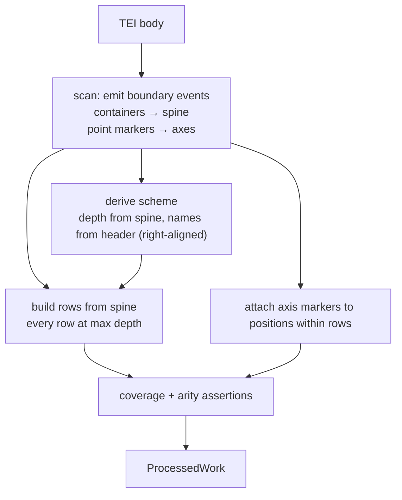

# Direction: A Proposed Model for Citation Structure

**Status:** proposal / discussion notes · nothing implemented · open questions flagged inline
**Prerequisite reading:** [V1_PREPROCESSING.md](V1_PREPROCESSING.md) — this document assumes its
findings and invariant numbering (INV-1 … INV-19).

---

## 1. The core reframe

V1 entangles three questions that want separate answers:

1. **What is the citation scheme?** (how many levels, what they are called)
2. **Where do the boundaries fall in the text?**
3. **What does this markup mean?**

Today the TEI header answers (1) _and_ is used to validate (2), while (2) is only recognised in one
syntactic form (nested `div[type=textpart]`). That coupling is the whole problem.
[Topica](V1_PREPROCESSING.md#sec-topica) and
[Historia Augusta](V1_PREPROCESSING.md#sec-historia-augusta) both fail
not because their structure is unusual, but because the header and the tree are being asked to
corroborate each other when neither is authoritative.

Separating the three is the organising idea behind everything below.

---

## 2. Milestones: don't convert them to divs

The most important thing about `<milestone>` is _why it exists in TEI_: **it is the encoding for a
division that does not nest inside the primary hierarchy.** If it nested, the editor would have
used a `div`.

So any design whose plan is "recognise milestones and promote them to divs" is fighting the
encoding. That is visible immediately in our two real cases, where the milestones point in
**opposite directions**:

| Work             | Spine (divs) | Milestone axis                 | Relationship                       |
| ---------------- | ------------ | ------------------------------ | ---------------------------------- |
| Historia Augusta | `chapter`    | `section`, inside the chapters | axis is **finer** than the spine   |
| Topica           | `section`    | `chapter`, inside the sections | axis is **coarser** than the spine |

Topica is the harder one: a chapter boundary can land mid-section (27 chapters over 101 sections),
so `chapter` genuinely does not nest over `section`. One mechanism has to serve both cases.

### The model

> **A work is one hierarchical spine plus zero or more linear marker axes over the same text
> stream.**

- The **spine** comes from nested containers (`div`, `seg`, `lg`/`l`). It nests by construction —
  it is a tree, so it cannot not. It determines rows and pages.
- An **axis** is an ordered sequence of `(position, level, ordinal)` events from point markers
  (`milestone`, `pb`, `lb`). It carries **no nesting claim at all**.

This generalises past the two cases for free: print page numbers (`<pb/>`), Stephanus pages, Bekker
numbers, and line numbers in prose editions are all the same mechanism. "Does this work have
milestones" stops being a special case and becomes "how many axes does it have".



---

## 3. Rows, and the max-depth guarantee

It is easier for the UI if all text is associated with a max-part section. That should be an
**enforced output property rather than an emergent one** — the current silent-degradation mode
(Topica rendering with `sectionCount: 0`, every row non-citable, no gutter, no anchors) is the worst
single behaviour found in the study, and it happens precisely because the property is inferred
rather than checked.

Concretely, change the row model from `[id, content]` to something like:

```ts
interface Row {
  id: string[];
  citable: boolean;
  content: Node;
}
```

Citability becomes **declared, not inferred** from `id.length === textParts.length` ([INV-17]).
Then:

- Every citable row is at full spine depth by construction — the spine is a tree, so uniform depth
  is just "did we descend to leaves".
- Material above the leaf level (headings, editorial prefaces, interstitial text) is
  `citable: false` and **attached to the following leaf section**. All text is therefore associated
  with a max-depth section, without pretending a heading is section `1.0`.
- Build-time assertions become expressible that V1 cannot state today:
  - no work has zero citable rows _(would have caught Topica, and Academica books 2–3)_
  - **coverage**: every character in the body lands in exactly one row
  - `id` arity is uniform across citable rows

This promotes [INV-17] from an accidental V2-side consequence to a checked V1-side contract. Note
that it makes the pipeline **stricter overall while making it structurally more permissive**, which
is the trade this whole effort is aiming for.

Related cleanup: keep IDs as arrays internally and join only for display and URLs, with escaping.
The ban on `.` inside an ID component ([INV-5]) exists purely as an artifact of string
concatenation.

---

## 4. Scheme derivation

Depth comes from the spine. Names come from the header, **right-aligned** onto observed levels,
with a fallback chain and **no failure mode**:

```
per-work override  >  CTS refsDecl  >  non-CTS refState  >  observed subtype/unit  >  "Level N"
```

Right-alignment is what handles Historia Augusta: the header declares `["work","chapter","section"]`
where `work` is the _Historia Augusta collection_ and has no representation in the file at all.
Aligning from the leaf end drops the unrepresented outer level automatically instead of throwing 76
times. A count mismatch becomes a build **warning** with the diff printed, not an error.

This is safe because V2 already treats `textParts` as display labels only, with a fallback at every
call site and an explicit regression test for `textParts` being shorter than the citation depth
(see [§0 of the study](V1_PREPROCESSING.md#0-executive-summary)).

### What disappears

`FORCE_CTS_WORKS` becomes unnecessary. So do `NO_SUBTYPES` and `IGNORE_SUBTYPES`, which are both
really "which attribute names this level" — a question that evaporates once names are taken _from_
the document rather than matched _against_ it. Four of the five per-work escape hatches catalogued
in [§1.4](V1_PREPROCESSING.md#14-getsectionid--the-structural-heart) **disappear rather than getting
consolidated**, which is a better outcome than a tidier config file.

---

## 5. Markup

The markup invariants are essential in kind and incidental in extent: we simply need to know how to
translate a given element to HTML, and that is usually not hard to add. Four changes, none
architectural:

1. **One vocabulary, not two.** Merging `transformContentNode` and `transformNoteNode` removes two
   of _Academica_'s three blockers on its own. Notes are content in a different position; if an
   element is genuinely illegal inside a note, express that as a context predicate on a single
   table rather than as a second function with its own drifting allowlists.
2. **Table-driven, not switch-driven.** `tag → {handler, allowedRends, allowedAttrs, contexts}`.
   Adding `<forename>` then unblocks 34 Livy works as a data change; treating `rend=""` as absent
   unblocks 17 more.
3. **Collect all errors per work; don't stop at the first.** Onboarding currently reports one of the
   six things a work needs, and you learn the second only after fixing the first. (This is also why
   the corpus table in the study has to be read across rows rather than down columns —
   first-error-wins bucketing.)
4. **Match on child sets, not sequence.** The `<abbr><expan>` positional check is a straight bug.

### One principle worth stating explicitly

> Every attribute is either **rendered**, **explicitly ignored with a stated reason**, or
> **fatal**. "Accepted into an allowlist and then never read" is banned.

This is the exact mechanism that produced the _Academica_ speaker-label bug: `place="inline"` passes
[INV-10] and is then dropped on the floor, so eleven dialogue speaker labels became footnote markers
with nothing complaining. The allowlist gave the _appearance_ of a fidelity guarantee at precisely
the point where it was not providing one.

---

## 6. Open questions

These two need a decision before anything is built; they change the row contract.

### Q1 — Promotion vs inline anchors for axes

Given an axis, we can either:

- **Promote** it into the spine (HA: sections become real rows; Topica: sections get grouped under
  chapters). Gives clean hierarchical citations with no UI change. Only _valid_ when the axis
  provably aligns with spine boundaries — which is checkable at build time, and should be a hard
  check rather than a hope.
- **Keep it inline** — render markers as inline citable anchors within a row. Always faithful,
  always available, but needs a new V2 capability: an inline or marginal citation anchor distinct
  from the block-level `reader-gutter` model.

Topica's chapters almost certainly do not align, and HA's sections start mid-paragraph, so both of
our real cases need inline. Building inline first is the general and correct answer, but it puts a
V2 feature on the critical path; promotion-only, accepting chapter-granular citation on HA for now,
is the cheaper alternative.

### Q2 — Mid-paragraph splitting

Even on the spine, and certainly under promotion, we hit `<p>text <boundary/> more text</p>`.
Splitting requires cloning the ancestor chain and yields two paragraphs where the edition has one.
Options:

- **Split and accept it.** Matches how div-encoded section works such as _De Optimo Genere Oratorum_
  already render, so it is at least self-consistent.
- **Split with a `continues: true` flag** so V2 can rejoin them visually.

---

## 7. Staging

Roughly in increasing order of cost. These are largely independent; the third row is the one with
the most leverage and does not depend on the spine/axis work landing.

| Step                                                                                  | Unblocks                                              | Cost                       |
| ------------------------------------------------------------------------------------- | ----------------------------------------------------- | -------------------------- |
| Markup data additions (`forename`, `rend=""`, `sub`, `<p>` in notes, `abbr` ordering) | ~60 works                                             | hours                      |
| Merge the two markup vocabularies; collect-all-errors                                 | —                                                     | small                      |
| [INV-3] → warning, right-aligned names, **plus** explicit arity/coverage assertions   | ~130 works                                            | medium                     |
| Spine/axis model with inline anchors                                                  | HA textgroup, Topica, and Stephanus-style works later | the real work              |
| V2: speaker labels, inline citation anchors                                           | _Academica_                                           | small–medium, but it is UI |

The third step is worth pushing hardest: it is the only change that simultaneously removes the
biggest structural blocker and _closes_ a real fidelity hole.

[INV-3]: V1_PREPROCESSING.md#inv-3
[INV-5]: V1_PREPROCESSING.md#inv-5
[INV-10]: V1_PREPROCESSING.md#inv-10
[INV-17]: V1_PREPROCESSING.md#inv-17
