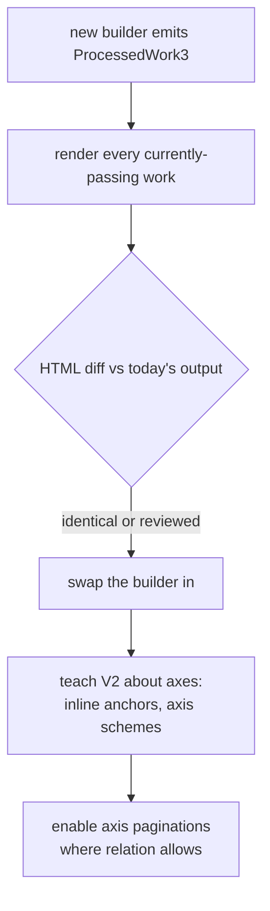

# Output Model: What Library Processing Returns

**Status:** proposal · prototyped end-to-end, not implemented in `src/` · open decisions in §11
**Prerequisite reading:** [V1_PREPROCESSING.md](V1_PREPROCESSING.md) (invariant numbering INV-1 … INV-19)
and [DIRECTION.md](DIRECTION.md) (the spine/axis model).
**Scope:** the **data contract** returned by the pre-processing stage — the successor to
`ProcessedWork2`. How the TEI scan produces it is deliberately out of scope; this document says what
it must hand over and what it promises about it.

> [!NOTE]
> Everything here has been exercised against real TEI by a standalone prototype — see
> [§10](#10-prototype-validation). Numbers in this document are measured, not estimated. Where the
> prototype contradicted the design, the design changed; those places are called out.

---

## 1. The contract in one sentence

> A work is **one flat ordered row list**, addressed by **one hierarchical spine** and **zero or
> more linear axes**, over which **one or more citation schemes** and **one or more paginations** are
> defined as views.

Four things follow, and they are the whole design:

|                                    | Consequence                                                                                                               |
| ---------------------------------- | ------------------------------------------------------------------------------------------------------------------------- |
| Rows stay flat and ordered         | [INV-16](V1_PREPROCESSING.md#inv-16) survives untouched; the reader keeps iterating `rows[start..end]`.                   |
| Schemes are plural                 | `textParts` stops being _the_ citation and becomes _the default_ one. Axes get to be citable without displacing anything. |
| Paginations are views, not content | A page is a row range. N paginations cost N small index structures, not N copies of the text.                             |
| Everything else is derived         | `textParts`, `paginationDepth`, `navTree` are all projections.                                                            |

---

## 2. The type

```ts
// ─────────────────────────────── content ───────────────────────────────

type ContentNodeType =
  | "span"
  | "head"
  | "gap"
  | "b"
  | "br"
  | "space"
  | "ul"
  | "li"
  | "note"
  | "marker"; // NEW: an axis marker's in-flow position

interface Row {
  /** Spine coordinate. May be shorter than `spine.length` (headings, prefaces). */
  id: string[];
  /** Declared, never inferred from arity. See OUT-2. */
  citable: boolean;
  /**
   * Rendering hint for this row alone. Verse-ness is a property of a passage,
   * not of a work: Topica is prose containing five quoted Ennius lines.
   */
  display?: "verse";
  content: XmlNode<ContentNodeType>;
}

// ──────────────────────────────── axes ─────────────────────────────────

interface AxisMarker {
  /** The ordinal as it should be displayed, e.g. "5". */
  ordinal: string;
  /** Which source attribute it came from, or `sequence` if the builder invented it. */
  ordinalFrom: "n" | "xml:id" | "corresp" | "sequence";
  /**
   * Human citation key, e.g. ["9","3"]. Best-effort and **may collide** — see
   * OUT-6b. Never use this as an identity.
   */
  key: string[];
  /** Positional identity, `${axisId}-${sequence}`. Unique by construction. */
  markerId: string;
  /** Index into `rows`. */
  row: number;
  /** `rows[row].id`, denormalised so labelling never has to walk back. */
  spineId: string[];
}

/** How an axis sits against the spine. Computed at build time, asserted (OUT-9). */
type AxisRelation = "aligned" | "finer" | "coarser" | "crossing";

interface Axis {
  /** Unique within the work; appears in URLs. */
  id: string;
  /** Display name, e.g. "chapter". */
  name: string;
  kind: "milestone" | "pageBreak" | "lineBreak";
  /** Ordered by position in the row stream. */
  markers: AxisMarker[];
  relation: AxisRelation;
  /** Set iff `relation === "aligned"`: the spine depth it coincides with. */
  alignedDepth?: number;
}

// ─────────────────────────── citation schemes ──────────────────────────

type CitationLevel =
  | { source: "spine"; depth: number; name: string }
  | { source: "axis"; axisId: string; name: string };

interface CitationScheme {
  id: string;
  /** Outermost first. Must narrow left-to-right (OUT-8). */
  levels: CitationLevel[];
}

// ──────────────────────────── pagination ───────────────────────────────

interface Page {
  id: string[];
  /** Half-open row range. */
  rows: [number, number];
  /** Set only when a page begins or ends inside a row (crossing axes). */
  startMarker?: string;
  endMarker?: string;
}

interface Pagination {
  id: string;
  /** Page ids are expressed in this scheme… */
  schemeId: string;
  /** …truncated to this many levels. Chosen, never derived — see §5. */
  depth: number;
  pages: Page[];
  navTree: NavTreeNode;
}

// ───────────────────────────── the work ────────────────────────────────

interface Diagnostic {
  code: string; // "AXIS_KEYS_AMBIGUOUS", "MARKER_NOT_EXPOSED", …
  severity: "warning" | "note";
  message: string;
}

interface ProcessedWork3 {
  info: DocumentInfo;
  /** Hierarchical spine level names, outermost first. Depth comes from the tree. */
  spine: string[];
  axes: Axis[];
  /** Non-empty. `schemes[0]` is the default. */
  schemes: CitationScheme[];
  rows: Row[];
  /** Non-empty. `paginations[0]` is the default. */
  paginations: Pagination[];
  notes?: XmlNode[];
  /** Non-fatal build observations, carried into the artifact rather than the log. */
  diagnostics: Diagnostic[];
}
```

### `markerId` vs `key` — identity is not citation

This split is the single most important correction the prototype forced, and it took two wrong
attempts to find (§10.3). The short version:

> **Identity must be guaranteed unique. Citation cannot be.**

`markerId` is positional, so it is unique by construction regardless of what the source does. `key`
is the human-facing citation, assembled from the ordinal and an enclosing spine prefix, and real
sources do produce duplicates — Pliny marks `section 127` twice inside book 8 chapter 36, and Book 1
of the _Naturalis Historia_ is a table of contents whose chapters re-use the paragraph numbers of
the books they summarise. **No spine prefix can disambiguate those**, because the duplicates sit
inside a single row.

So a colliding key is a fact about the source, reported and moved past, not a build failure.

### Markers live in the tree _and_ in an index

The in-flow `<marker/>` node is what lets the renderer emit an anchor mid-paragraph; the
`Axis.markers` index is what lets resolution find a page in O(1). Both are needed, and the
redundancy is checked (OUT-7).

> [!NOTE]
> Not a new pattern — it is how notes already work. `preprocessTree` hoists note bodies into a
> work-level array and leaves an empty `<note noteId="N"/>` in the tree
> ([§1.3](V1_PREPROCESSING.md#13-preprocesstree--annotation-pass)).

---

## 3. `AxisRelation` is the load-bearing field

The four relations are not descriptive colour. Each licenses a _different_ implementation strategy,
and the classification is computable from marker positions alone:

| Relation   | Definition                                                                        | Strategy                                           | Needs                                                        |
| ---------- | --------------------------------------------------------------------------------- | -------------------------------------------------- | ------------------------------------------------------------ |
| `aligned`  | every marker coincides with a spine row boundary at a fixed depth, and vice versa | **fold into the spine; emit no axis at all**       | nothing                                                      |
| `finer`    | every spine row starts with a marker, and there are more markers than rows        | inline anchors; append the axis as a scheme level  | inline anchor rendering                                      |
| `coarser`  | every marker sits at a row start, and there are fewer markers than rows           | axis pagination; page edges land on row boundaries | nothing extra                                                |
| `crossing` | neither — boundaries interleave                                                   | axis pagination **requires mid-row splitting**     | a decision on [Q2](DIRECTION.md#q2--mid-paragraph-splitting) |

This localises DIRECTION.md's two open questions. Promotion is legal **iff** `aligned`, so Q1 stops
being a global choice and becomes a per-axis fact. Q2 is only ever reached by `crossing` axes.

---

## 4. Axis policy: recognising a marker is not exposing it

**"Is this a point marker?" and "is this a citation axis?" are different questions.** The first is
parsing; the second is policy. Fusing them was a mistake in the first draft of this document and in
the prototype.

`<pb>` is the clean case. Perseus records where a page broke in the specific printed edition a file
was transcribed from — Pliny's are `xml:id="v.4.p.99"`, volume and page of a Teubner nobody is
holding, and 5 of its 2,525 carry no identifier at all. That is print fidelity, not a citation
scheme. **We do not have the printed book.**

So the model carries a policy table, as data:

| Marker              | Default                          | Rationale                                         |
| ------------------- | -------------------------------- | ------------------------------------------------- |
| `milestone[unit=…]` | expose                           | this is TEI's encoding for a non-nesting division |
| `pb`                | recognise, don't expose          | print-layout fidelity                             |
| `lb`                | recognise, don't expose          | ditto                                             |
| unknown unit        | expose **and** emit a diagnostic | new corpora should surface, not vanish            |

Two things this must not become:

1. **A silent drop.** `// Ignore milestones for now, but we may need to use it later`
   ([process_work.ts:478](../../../../common/library/process_work.ts#L478-L482)) is how the
   corpus lost a citation level for years. Non-exposed markers are counted and reported:
   `note: 2525 <page> marker(s) recognised but not exposed as an axis`. They are then dropped from
   the row tree — they buy nothing today, and the source is always re-parseable.
2. **Element-level only.** The same question applies _within_ milestones. Pliny exposes `section`
   (6,927), `paragraph` (4,807) and `para` (8, evidently a misspelling of the second). NH is cited
   `book.chapter.section`; `paragraph` is plausibly the same category of print artifact as `<pb>`,
   just differently encoded. Policy has to be unit-aware.

Nothing is lost architecturally by not exposing `<pb>` now. If the corpus ever reaches texts where
print pagination genuinely _is_ the citation, that is a policy flip on a mechanism that already
works.

---

## 5. Pagination depth is chosen, not derived

[`divideWork`](../../../../common/library/process_work.ts#L956-L996) sets page depth to
`textParts.length - 1` — "the leaf level scrolls, the level above is the page". That derivation is
a defect, and Pliny shows what it costs.

Pliny's `textParts` is `["book", "chapter"]`, so a page is an **entire book**: 37 pages for the whole
encyclopedia. The level below chapter exists in the source as 11,742 milestones, which V1 drops —
and dropping them shortens `textParts`, which promotes the page one level coarser than the text's
actual structure.

|                     | Pages | Notes per page                  |
| ------------------- | ----: | ------------------------------- |
| Today (page = book) |    37 | **1,868 average**               |
| Chapter-level       | 1,248 | **28 median**, 135 p90, 856 max |

Page 1 of the _Naturalis Historia_ currently ships 2,775 endnotes — 1,084 KB of notes HTML against
519 KB of text. Under this model `Pagination.depth` is explicit, so NH can be paginated at
`book.chapter` **independently of any axis work**.

> [!NOTE]
> For calibration, this is a genuine outlier rather than a systemic problem. Across the 48 works in
> the library that have notes at all, the next worst are Cicero's _Philippicae_ (573 on its worst
> page) and _De Finibus_ (500). Ammianus — heavily annotated and often cited as the stress case —
> runs a median of 9 notes per page over 216 pages.

---

## 6. The checked output contract

These replace the output-shape invariants and promote the ones V1 leaves to chance.

|            | Assertion                                                                                                                                                     | Severity       | Replaces / relates to                                                  |
| ---------- | ------------------------------------------------------------------------------------------------------------------------------------------------------------- | -------------- | ---------------------------------------------------------------------- |
| **OUT-1**  | **Coverage.** Whitespace-normalised concatenation of all row text equals the normalised source text.                                                          | fatal          | new — nothing checks this today                                        |
| **OUT-2**  | At least one citable row exists; every citable row has `id.length === spine.length`.                                                                          | fatal          | promotes [INV-17](V1_PREPROCESSING.md#inv-17) to a build-side contract |
| **OUT-3**  | No id component contains `.`.                                                                                                                                 | fatal          | [INV-5](V1_PREPROCESSING.md#inv-5), retained                           |
| **OUT-4**  | For each pagination, page row ranges are contiguous, non-overlapping, and cover `[0, rows.length)`.                                                           | fatal          | generalises [INV-18](V1_PREPROCESSING.md#inv-18)                       |
| **OUT-5**  | Page ids are unique within a pagination.                                                                                                                      | fatal          | [INV-18](V1_PREPROCESSING.md#inv-18)                                   |
| **OUT-6a** | Axis `markerId`s are unique.                                                                                                                                  | fatal          | new — structural, true by construction                                 |
| **OUT-6b** | Axis citation `key`s are unique.                                                                                                                              | **diagnostic** | new — a property of the source, not of the build                       |
| **OUT-7**  | Referential integrity both ways: every `markerId` occurs exactly once as a `<marker>` in `rows[marker.row]`, and every `<marker>` is indexed. Likewise notes. | fatal          | new                                                                    |
| **OUT-8**  | Every scheme narrows left-to-right and is satisfiable; `schemes[0]` exists.                                                                                   | fatal          | new                                                                    |
| **OUT-9**  | Each axis's declared `relation` is recomputable from its markers.                                                                                             | fatal          | new                                                                    |

> [!IMPORTANT]
> OUT-1 and OUT-2 are the two that would have caught the silent failures in the study — _Topica_
> rendering with `sectionCount: 0`, _Academica_ books 2–3 shipping uncitable. Both are cheap. OUT-1
> needs no provenance tracking: normalise whitespace on both sides and compare two strings.

**OUT-1's scope is an open question.** As written it says "the body", which is how the prototype
implements it — and that is exactly why it cannot see that _Topica_'s SIGLA page, a real
`<div type="textpart">` sitting in `<front>`, is invisible to every consumer. Widening it to
`<text>` would catch that class of loss. See [D3](#11-open-decisions).

The markup invariants ([INV-8](V1_PREPROCESSING.md#inv-8)–[INV-14](V1_PREPROCESSING.md#inv-14)) are
unaffected. They constrain what may appear _inside_ `Row.content` and are orthogonal to addressing.

---

## 7. Pipeline shape: two stages, not three

Today's chain is three transforms: TEI → `ProcessedWork2` → `V2PreprocessedWork` (pre-rendered page
HTML) → served page. Dropping V1 compatibility allows two: **TEI → structured form → SSR page**.

The principle that decides where the cut goes:

> The boundary belongs at **the last point where the answer doesn't depend on the request.**

| Request-independent → build                                        | Request-dependent → SSR                                               |
| ------------------------------------------------------------------ | --------------------------------------------------------------------- |
| parse, markup normalisation, spine, axes, rows, notes, diagnostics | which pagination, which page, which view mode                         |
|                                                                    | note numbering (restarts per page)                                    |
|                                                                    | citation label elision (`cite-prefix`/`cite-local` are page-relative) |
|                                                                    | verse line labelling (counts within the page)                         |

`v2_preprocessor` currently sits on the wrong side of that line: it bakes all four request-dependent
things into the build. Harmless while there is exactly one pagination — but it means the V2 artifact
is not a cache of the work, it is a cache of **(work × pagination × view mode)**. Axes are precisely
what makes that product grow.

### What request-time rendering costs

Measured on the real build artifacts, median of 10, warm:

| Work                                |  rows | pages |   ms/page |
| ----------------------------------- | ----: | ----: | --------: |
| Cicero, _De Optimo Genere Oratorum_ |    24 |    23 | **0.016** |
| Caesar, _De Bello Gallico_          | 2,158 |   404 | **0.022** |
| Vergil, _Aeneid_ (verse)            | 9,896 |    12 |   **2.8** |
| Pliny, _Naturalis Historia_         | 1,248 |    37 |  **18.5** |

Three of four are comfortably inside a request budget. The outlier is outlier _data_ — stripping
note bodies takes Pliny from 554 ms to 59 ms for the whole work — and §5 would reduce it directly.

**Proposal: render at request time, with an LRU cache of rendered pages keyed by
`(workId, paginationId, pageId, viewMode)`.** Pre-rendering becomes a tunable optimisation rather
than a decision baked into the artifact, and a cache costs nothing for paginations nobody requests.

---

## 8. What this asks of the V2 pre-processor

1. **`isVerseWork` goes away.** It sniffs `textParts[last] === "line"`
   ([v2_preprocessor.ts:299-301](../../../../common/library/v2/v2_preprocessor.ts#L299-L301)), which
   is why a mis-derived `textParts` silently rendered _Topica_'s prose as verse. It reads
   `Row.display` instead.
2. **Translation alignment gets an explicit key.** Today it is row-id string equality
   ([v2_preprocessor.ts:312-315](../../../../common/library/v2/v2_preprocessor.ts#L312-L315)), which
   silently yields blank panels on mismatch. Align on the default-scheme citation string; an
   unmatched row is a `Diagnostic`.
3. **Per-row HTML instead of per-page**, per §7.
4. **Anchors use the key, with `markerId` underneath.** The prototype initially emitted `markerId`
   as the DOM `id`, which turned the shareable `#cite-section-9.3` into `#cite-section-77`. Emit the
   key as `id` when unambiguous and carry `markerId` in a `data-` attribute, so links stay
   human-readable and resolution keeps a guaranteed handle.

---

## 9. Migration

No V1 compatibility requirement, so there is no projection shim to maintain. The regression gate is
**diffing rendered HTML** across the works that process today:



This is both a stronger check than comparing intermediates — it tests what users see — and a weaker
constraint, since the intermediate can be whatever we want. The 72 visual baselines back it up.
Works that only the new builder can process are pure addition and cannot regress anything.

---

## 10. Prototype validation

`.investigation/library-preprocessing/proto_axes.ts` builds this model directly from TEI, sharing no
code with `src/common/library/`, so no V1 invariant constrains it. It classifies relations, runs the
OUT-n assertions, renders pages and resolves citations.

### 10.1 Results

**Both blocked milestone works build with no header involvement at all** — no `refsDecl`, no
`FORCE_CTS_WORKS`, no INV-3. Spine names come from the observed `subtype`.

|                       | Spine                | Rows                  | Axes                                                               |    Coverage |
| --------------------- | -------------------- | --------------------- | ------------------------------------------------------------------ | ----------: |
| HA, _Didius Julianus_ | `["chapter"]`        | 9 (9 citable)         | `section` ×78 **finer**                                            |    12,357 ✓ |
| Cicero, _Topica_      | `["section"]`        | 101 (100 citable)     | `chapter` ×26 **crossing**                                         |    49,449 ✓ |
| Pliny, _Nat. Hist._   | `["book","chapter"]` | 1,154 (1,116 citable) | `section` ×6,927, `paragraph` ×4,807, `para` ×8 — all **crossing** | 5,087,252 ✓ |

Coverage round-trips the whole 13 MB Pliny file, which is a reasonable validation of the row model
at scale. HA's default scheme becomes `chapter.section` — the citation scholars actually use, and
the one [§3.3](V1_PREPROCESSING.md#sec-historia-augusta) records as lost.

Citation resolution, including the case the whole model exists for — an axis citation landing on a
page named in a different scheme:

```
HA      default:9.3     → page 8  (id "9")   anchor #cite-section-9.3
Topica  default:17      → page 16 (id "17")  anchor #sec-17
Topica  chapter:5       → page 24 (id "25")  anchor #cite-chapter-5
```

### 10.2 What the prototype changed about the design

- **Multi-axis is the normal case, not the exception.** Every work examined has more than one point-
  marker axis; Pliny has four. An earlier draft treated one-axis-per-work as typical.
- **`relation` classification held up.** `finer` for HA, `crossing` for Topica, both predicted before
  the code was written.
- **Axis policy had to be introduced** (§4) — the prototype exposed `<pb>` as a citable axis, which
  is wrong.
- **Pagination depth had to become explicit** (§5).

### 10.3 Key scoping: two wrong answers before the right one

Worth recording because the failure mode is instructive.

1. _Scope keys when ordinals are not numerically monotonic._ Wrong: `<pb n="p.350"/>` parses as
   `NaN`, so page axes were needlessly qualified and `page:p.350` stopped resolving.
2. _Always qualify by the full spine coordinate._ Wrong: still left 111 colliding markers in Pliny.
3. **Correct: the shortest spine prefix that yields uniqueness — and accept that sometimes none
   does.** Empirically: Topica's chapters need **0** levels, HA's sections need **1**, Pliny's
   sections and paragraphs need **2** and still leave 2 and 62 ambiguous keys respectively.

Diagnosing (2) turned up three independent causes, only one of which was the expected "ordinals
restart":

| Cause                                                                 | Markers | Fix                                              |
| --------------------------------------------------------------------- | ------: | ------------------------------------------------ |
| Ordinal in `xml:id`, not `n` — all 2,525 Pliny `<pb>`, none with `@n` |   2,520 | fallback chain `n → xml:id → corresp → sequence` |
| No ordinal attribute at all (bare `<pb/>`)                            |       5 | positional ordinal + warning                     |
| Ordinal genuinely repeated **inside one row**                         |     111 | none possible — hence OUT-6a/6b                  |

The first is the mirror image of [INV-7](V1_PREPROCESSING.md#inv-7), where HA pairs note bodies via
`n` instead of the expected `xml:id`. Under the §4 policy `<pb>` is no longer exposed, so causes 1
and 2 no longer arise in practice and the fallback chain is currently unexercised insurance — but
cause 3 is milestone-only and stands on its own.

### 10.4 Caveat

Validated on 3 works, 4 axis shapes, ~11,800 exposed markers. The scope rule and the relation
classifier should be run over all 398 works and the diagnostic distribution inspected before either
is trusted in a builder.

---

## 11. Open decisions

|        | Decision                                                                                                                         | Recommendation                                                                                         |
| ------ | -------------------------------------------------------------------------------------------------------------------------------- | ------------------------------------------------------------------------------------------------------ |
| **D1** | Pipeline shape (§7): pre-rendered page HTML, or request-time rendering from one structured artifact?                             | Two stages + LRU cache. Blocks §7–§9.                                                                  |
| **D2** | Mid-row splitting ([Q2](DIRECTION.md#q2--mid-paragraph-splitting)) — do `crossing` axes get real pages, or locate-and-highlight? | Locate-and-highlight first; only Topica needs more so far.                                             |
| **D3** | Is OUT-1 scoped to `<body>` or `<text>`? Is front matter content?                                                                | Widen to `<text>`; OUT-1 provably cannot catch the SIGLA-page loss as written.                         |
| **D4** | Are schemes derived, or authored with per-work overrides?                                                                        | Derive first, add overrides on demand.                                                                 |
| **D5** | Are paginations stored or computed?                                                                                              | Computed — a pure function of `(rows, axes, scheme, depth)`, asserted at build. No staleness possible. |
| **D6** | Is the `paragraph` axis in Pliny a citation scheme or a print artifact (§4)?                                                     | Needs a look at the source edition; affects the unit-level policy table.                               |

---

_Provenance: drafted from [Jetski conversation db5d1df2](conversation://db5d1df2-3a8f-4635-bf10-a7e938b068d2), Sep 2026. Proposal plus throwaway prototype — no pipeline code changed._
