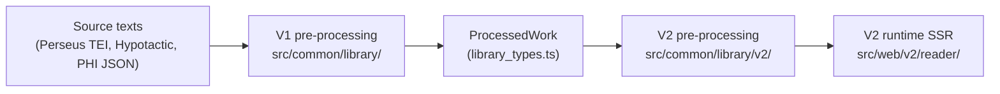

# Library Pre-Processing — V2 Investigation

Notes on the source-text pre-processing pipeline that feeds the V2 reader, and on where it should
go next.

> [!NOTE]
> These documents are scoped to **V2**. They assume the legacy React reader will not be adapted to
> any of the changes proposed here, which removes a large compatibility constraint: the only
> consumer that has to keep working is `src/web/v2/reader/`.

## The problem, briefly

Producing a reader page takes three stages:

Stage B — the V1 layer — is the bottleneck. It works hard to coerce arbitrary TEI into one clean,
uniformly-nested tree, and sources that don't fit that shape need bespoke code, hand-written
patches, or stay unavailable. **139 of the 398 Latin works in the Perseus repo currently process.**

Two distinct kinds of strictness are tangled together in that layer, and they deserve opposite
treatment:

1. **Structural rigidity** — assumptions about how a document must be shaped (uniform nesting, a
   header that agrees with the body, divisions encoded only as nested `div`s). This is the dominant
   blocker: **66% of failures are structural or metadata, before any markup is examined.** Most of
   it turns out to be incidental to what the reader actually needs.

2. **Markup defensiveness** — an allowlist of which elements and `rend` values are acceptable in
   which contexts, throwing on anything unrecognised. This is the _only_ automated guarantee of
   faithful rendering that exists today, and it is usually cheap to extend when a new element shows
   up.

   > [!IMPORTANT]
   > The defensiveness is a feature and must be preserved. Anything that buys structural
   > flexibility by becoming permissive about markup is the wrong trade.

A third problem sits underneath both: the pipeline's strictness is aimed at the wrong things.
Several checks that _do_ matter — that every work has citable content, that citation depth is
uniform, that no text is silently dropped — are not enforced anywhere, so a work can process
"successfully" and render with no citations at all.

## Source corpus

The Perseus-derived Latin texts are **not** in this repository. They come from
[nkprasad12/canonical-latinLit](https://github.com/nkprasad12/canonical-latinLit), a fork of the
Perseus Digital Library's canonical corpus, kept as a local sync and pointed at by the
`LIB_XML_ROOT` environment variable in `.env` (also used by
[`src/scripts/process_lat_lib.ts`](../../../../scripts/process_lat_lib.ts)).

Individual works live at `$LIB_XML_ROOT/data/<textgroup>/<work>/<id>.xml`. The "398 works" figure
used throughout these documents is every `perseus-lat*` edition found under that tree. Which of
them are actually built is a separate, hand-maintained question — see
[`library_constants.ts`](../../../../common/library/library_constants.ts).

## Documents

| Document                                   | What it is                                                                                                                                                                                                                      |
| ------------------------------------------ | ------------------------------------------------------------------------------------------------------------------------------------------------------------------------------------------------------------------------------- |
| [V1_PREPROCESSING.md](V1_PREPROCESSING.md) | The study. What V1 does stage by stage, an inventory of 19 structural/markup/output invariants with enforcement sites, and a catalogue of how real unintegrated works deviate. Includes corpus-wide numbers over all 398 works. |
| [DIRECTION.md](DIRECTION.md)               | Where this should go: a proposed model for citation structure (a hierarchical spine plus linear marker axes), how it handles milestones, and a staged path to get there. Open questions are flagged.                            |

## Scratch work

Investigation tooling — instrumentation scripts, probes, corpus surveys — **may** be present
locally under `.investigation/<topic>/`, e.g. `.investigation/library-preprocessing/` for the work
behind these documents.

That directory is gitignored and is never checked in. It is a convention, not a guarantee: on a
fresh clone it will not exist, and nothing in these documents depends on it. It is written down so
that

- anyone picking this up knows **where to look** for tooling that may already exist, and
- anyone writing new throwaway tooling knows **where to put it** instead of scattering scripts
  through the source tree.

Scratch files go stale — they reference line numbers and internals of `src/` that move. If
something there no longer applies cleanly, delete it rather than repair it. What matters is
reproducibility of the _results_, and the commands for that are recorded in
[Appendix A](V1_PREPROCESSING.md#appendix-a--the-harness).

---

_Provenance: these documents came out of [Jetski conversation 806f6158](conversation://806f6158-b19f-4c1a-a2c0-c01c97fe2712), Sep 2026. Investigation only — no pipeline code was changed._
