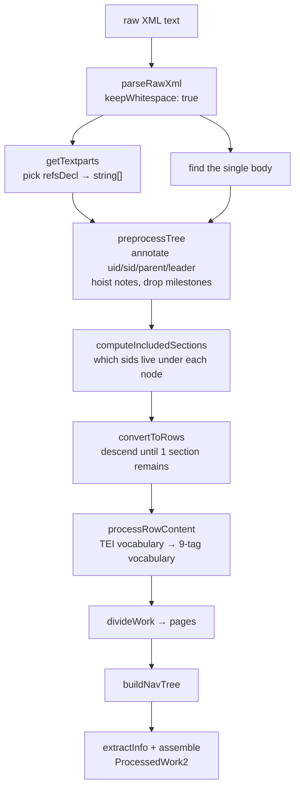

# V1 Library Pre-Processing: What It Does and What It Assumes

**Status:** investigation complete · no production code changed
**Scope:** `src/common/library/` (the V1 layer), source TEI → `ProcessedWork2`
**Method:** code reading cross-referenced against the real Perseus XML, plus a disposable
instrumentation harness (`.investigation/`, see [Appendix A](#appendix-a--the-harness)) run over
all 398 Latin works in `canonical-latinLit`.
**Context:** see [README.md](README.md). **Where this leads:** see [DIRECTION.md](DIRECTION.md).

---

## 0. Executive summary

Three findings drive everything below.

**1. The structural rigidity is real, and it is the dominant blocker.** Of the 398 Latin works in
the Perseus repo, 139 process today. Of the 259 that fail, **172 (66%) fail on structure or
metadata before any markup is examined.** Markup strictness is the _minority_ cause of onboarding
friction, not the majority.

**2. The single most expensive assumption is `textParts` agreement** — the requirement that the
division names declared in the TEI header exactly match the `subtype` chain observed in the body
tree, level for level, in order. This is invariant [INV-3](#inv-3). Relaxing just the _source_ of
`textParts` (derive it by walking the body rather than reading the header) takes passes from
139 → 156 and collapses header-ambiguity failures from 28 → 3.

**3. The V2 reader does not require this invariant.** It requires something much weaker, which
[INV-3](#inv-3) happens to imply but is not equivalent to. V2 has an explicit unit test for
`textParts` being _shorter_ than the citation depth
([reader.test.ts:639](../../../../web/v2/reader/reader.test.ts#L639-L643)),
and falls back to `Level N` / `Section` labels throughout. All three of the named case works render
correctly in V2 once the V1 check is bypassed — none of them needs new rendering capability.

> [!IMPORTANT]
> Two of the three committed code comments naming these blockers are inaccurate, in ways that
> matter. See [§3.1](#sec-topica) and [§3.2](#sec-academica).
> In particular the _Academica_ comment describes a **silent fidelity bug that no assertion catches** —
> which is the opposite of the "defensiveness is working" story.

### Corpus-wide numbers

All 398 `perseus-lat*` works, first-error-wins, categorised by the stack frame that threw. Every
column sums to 398:

| Failure category                                      | As shipped | Force CTS everywhere | Derive `textParts` from tree |
| ----------------------------------------------------- | ---------: | -------------------: | ---------------------------: |
| **OK**                                                |    **139** |              **148** |                      **156** |
| structure: nesting mismatch ([INV-3](#inv-3))         |        132 |                   76 |                           86 |
| `textParts`: refsDecl unusable ([INV-1](#inv-1))      |         28 |                  112 |                            3 |
| metadata: `titleStmt` incomplete ([INV-15](#inv-15))  |         12 |                   28 |                           40 |
| markup, all kinds ([INV-8](#inv-8)–[INV-14](#inv-14)) |         86 |                   33 |                          111 |
| other                                                 |          1 |                    1 |                            2 |

Read across a row rather than down a column: the markup count _rises_ in the right-hand columns
because more works now get far enough to reach the markup stage. The honest reading is the top
row — no single lever gets past ~40% — combined with the observation that the structural rows shrink
dramatically under a change that costs the UI nothing. A per-element breakdown of the 86 markup
failures is in [§3.5](#35-corpus-wide-beyond-the-commented-out-list).

---

## 1. What V1 does, stage by stage



### 1.1 Work selection and build entry

[`library_constants.ts`](../../../../common/library/library_constants.ts)
is a hand-maintained allowlist. `LatinWorks` maps a symbolic name to a Perseus work ID;
`ALL_SUPPORTED_WORKS` turns those into `data/<group>/<work>/<id>.xml` paths. There is no discovery
and no negative list — a work is onboarded by adding a line, and de-onboarded by commenting one out.
The `// TODO: We should just crawl some root.` at
[process_library.ts:44](../../../../common/library/process_library.ts#L44)
acknowledges this.

Two side tables live here and are load-bearing:

- `EnglishTranslations` — maps a Latin work ID to its translation's work ID. Alignment between the
  two is purely by _row ID string equality_ downstream
  ([v2_preprocessor.ts:312-315](../../../../common/library/v2/v2_preprocessor.ts#L312-L315)),
  so the two documents must independently produce identical citation IDs.
- `FORCE_CTS_WORKS` — a 24-entry override list saying "for this work, ignore the non-CTS `refsDecl`
  and use the CTS one instead". This is the escape hatch for [INV-1](#inv-1) and is discussed at
  length below.

[`process_library.ts`](../../../../common/library/process_library.ts)
orchestrates: it runs the PHI-JSON and Hypotactic converters first
([L244-245](../../../../common/library/process_library.ts#L244-L245)),
then loops over the Perseus paths. Translations are sorted to the front
([L230-233](../../../../common/library/process_library.ts#L230-L233))
so that `translationDataById` is populated before the Latin work that references it. Each result is
gzipped to disk and recorded in a `LibraryIndex`.

Note also the string-level hack at
[L254-257](../../../../common/library/process_library.ts#L254-L257):
a specific Perseus DOCTYPE block is `.replace()`d out of the raw text before parsing, because
`fast-xml-parser`'s declaration-skipping option doesn't work. Exact-match, so a whitespace
difference in a new file silently fails to strip and the parse breaks.

### 1.2 Deriving `textParts` — the two-headed header

[`getTextparts`](../../../../common/library/process_work.ts#L937-L953)
is where the pipeline decides what the document's division hierarchy _is called_. A Perseus TEI file
typically contains **two** `refsDecl` blocks that disagree:

```xml
<!-- Cicero, Topica (phi0474.phi042) -->
<refsDecl n="CTS">
   <cRefPattern n="section"
                matchPattern="(\w+).(\w+)"
                replacementPattern="#xpath(/tei:TEI/tei:text/tei:body/tei:div/tei:div[@n='$1'])">
```

```xml
<refsDecl n="TEI.2">
   <refState delim="." n="chunk" unit="chapter"/>
   <refState unit="section"/>
</refsDecl>
```

The CTS block says the citable unit is `section`, one level deep. The TEI.2 block says
`chapter` then `section`, two levels deep. The body has one level of `div`s, `subtype="section"`.
So the CTS block is right and the TEI.2 block is wrong — but V1's rule is:

```ts
const nonCts = refsDecls.filter((node) => node.getAttr("n") !== "CTS");
if (FORCE_CTS_WORKS.has(workId) || nonCts.length === 0) {
  return findCtsEncoding(root)...
}
assertEqual(nonCts.length, 1, ...);
```

**Prefer the non-CTS block unless the work is on the override list.** For Topica that picks the
wrong answer, and there is no way to say so short of editing `FORCE_CTS_WORKS`.

`findCtsEncoding`
([tei_utils.ts:239-261](../../../../common/xml/tei_utils.ts#L239-L261))
also validates the CTS block internally: it counts `(` in `matchPattern` to get `idSize`, parses
`replacementPattern` into a node path, and asserts the two agree. Topica's CTS block has two capture
groups and one `$1`, so _that_ path throws too — the file is internally inconsistent and neither
declaration is usable as-is.

### 1.3 `preprocessTree` — annotation pass

[`preprocessTree`](../../../../common/library/process_work.ts#L379-L496)
does a destructive-ish DFS over a deep copy, writing four synthetic attributes onto every node:

| Attr     | Meaning                                                                     |
| -------- | --------------------------------------------------------------------------- |
| `uid`    | index into a flat `uids[]` array; `uids[7]` is the node with `uid=7`        |
| `parent` | the `uid` of the parent, enabling upward walks without a parent pointer     |
| `sid`    | dot-joined section ID computed by `getSectionId` from the ancestor chain    |
| `leader` | set when this node is itself the node that introduced the last ID component |

Before writing, it asserts the source document doesn't already use those names
([L415-417](../../../../common/library/process_work.ts#L415-L417)) —
a neat, cheap guard.

Two structural edits happen in the same pass:

- **Notes are hoisted.** Any `<note>` is pushed into a work-level `notes[]` array; the in-tree node
  is emptied of children and tagged `noteId`
  ([L435-463](../../../../common/library/process_work.ts#L435-L463)).
  Two encodings are handled: content-in-place, and the split `<note target="x"/>` … `<note
xml:id="x">body</note>` form.
- **Milestones are dropped.**
  ```ts
  // Ignore milestones for now, but we may need to use it later.
  if (child.name === "milestone") {
    assertEqual(child.children.length, 0);
    continue;
  }
  ```
  ([L478-482](../../../../common/library/process_work.ts#L478-L482)).
  This line is the whole of §3.3.

### 1.4 `getSectionId` — the structural heart

[`getSectionId`](../../../../common/library/process_work.ts#L281-L342)
turns an ancestor chain into a citation ID like `["1","4","2"]`. It walks ancestors top-down keeping
a cursor `i` into `textParts`, and for each ancestor decides: is this a division at level `i`?

The decision procedure, in order:

1. `<seg>` — assert its `type` equals `textParts[i]`, take its `n`, advance.
2. If the work is in `NO_SUBTYPES` (only `TACITUS_DIALOGUS`), use `type` instead of `subtype`.
3. Skip anything that isn't `type="textpart"` — **except** `<l>`, which counts as a division if
   `i < textParts.length`, because "`l` is sometimes used even if the CTS says `line`, and it is
   often not marked".
4. Skip subtypes listed in `IGNORE_SUBTYPES` for this work (Catullus: `Lyrics`, `longpoems`,
   `Elegies`, `book`; Livy: `index`).
5. **Assert the observed level name equals `textParts[i]`.** ← [INV-3](#inv-3)
6. Take `n` via `checkPresent` — throw if absent — with one hardcoded exception for a
   De Rerum Natura `<l>` that contains only a `<gap>`.

Steps 2, 4 and 6 are all per-work hardcodes reached by string comparison against a work ID. That is
five distinct escape-hatch mechanisms (`NO_SUBTYPES`, `IGNORE_SUBTYPES`, `FORCE_CTS_WORKS`, the DRN
`assertEqual`, and `pruneSectionNumbering` for Livy) for what is arguably one problem.

### 1.5 `convertToRows` — where "a row" comes from

`ProcessedWork2.rows` is a flat list of `[citationId, contentNode]`. It is produced by
[`convertToRows`](../../../../common/library/process_work.ts#L559-L591),
which descends the annotated tree and stops as soon as a subtree contains exactly one distinct `sid`:

```ts
const sections = checkPresent(data.includedSections[uid]);
if (sections.size === 1) {
  /* ...attach nearest <lg>... */ return [[sid, current]];
}
```

This is the rule that makes the output flat rather than nested, and it is genuinely elegant: it
needs no knowledge of which elements are "structural", only of where section boundaries fall. A
string child encountered during the descent (interstitial text between two sub-sections) is wrapped
in a synthetic `<span>` and emitted as its own row — which is what makes the "Header1 / 3.6.1 /
Header2 / 3.6.2" case described in the comment at
[L390-399](../../../../common/library/process_work.ts#L390-L399)
work.

A `<lg>`-tracking side channel rides along here: `lg-sid` / `lg` attrs are attached, and
`processWorkBody` emits a synthetic `<space>` row whenever the enclosing `<lg>` changes
([L916-933](../../../../common/library/process_work.ts#L916-L933)).
That is how stanza breaks survive into a flat row list.

### 1.6 Content transformation — the allowlist

[`transformContentNode`](../../../../common/library/process_work.ts#L646-L809)
maps the open TEI vocabulary onto the closed nine-tag `ProcessedWorkContentNodeType` vocabulary
(`span | head | gap | b | br | space | ul | li | note`). It is a long `if`-chain followed by a
`switch` whose default is `throw new Error("Unknown node: " + name)`.

Semantics worth knowing:

- `<choice>` collapses to whichever child is `reg` / `corr` / `abbr` — the _corrected_ reading wins
  over `sic` / `orig`.
- `<abbr>` has two forms. Inside a `<choice>` it is the abbreviated alternative. Standalone with an
  `<expan>` child it is rendered abbreviated and the expansion dropped. **The standalone check is
  positional**: it requires children to be exactly `[string, <expan>]`
  ([L698-708](../../../../common/library/process_work.ts#L698-L708)),
  so `<abbr><expan><ex>Gaio</ex></expan>C.</abbr>` — node first, string second — falls through and
  hits `assertEqual(parent?.name, "choice")`.
- `<foreign xml:lang="greek">` runs its sole text child through `betaCodeToGreek`.
- `<q>` / `<quote>` get literal `“` `”` added unless `rend="blockquote"`.
- `rend` is checked against
  [`perseus_rends.ts`](../../../../common/library/perseus_rends.ts),
  which distinguishes _handled_ (becomes a CSS class downstream) from merely _known_ (accepted and
  deliberately ignored, e.g. `merge`). `isVisualGap` accepts strings of dots and asterisks by regex.

[`transformNoteNode`](../../../../common/library/process_work.ts#L593-L644)
is a parallel, _separate_ transformer for hoisted note bodies with its own allowlists
(`NOTE_NODES`, `KNOWN_NOTE_REND`). The two vocabularies overlap heavily but not exactly: `sup` is
allowed in a note `rend` but `sub` is not; `<p>` is allowed in content but not in a note. The
duplication is the direct cause of two of _Academica_'s three blockers.

### 1.7 Pagination and nav tree

[`divideWork`](../../../../common/library/process_work.ts#L956-L996)
groups consecutive rows by the first `textParts.length - 1` components of their ID — i.e. **the
leaf level is always the thing you scroll through, and the level above it is always the page.**
For a single-level work (`n === 1`) `idLength` stays `1`, so every section becomes its own page.
That is why _De Optimo Genere Oratorum_ ships as 23 pages of one section each.

`buildNavTree` then folds the page IDs into a prefix tree. Rows whose ID is shorter than `idLength`
(headings, prefatory matter) reset the page accumulator and belong to no page.

### 1.8 Patches — the manual escape hatch

[`library_patches.ts`](../../../../common/library/library_patches.ts)
loads `patches/<workId>.xml.patch.json`, each entry a `{location, target, replacement, reason}`
tuple. `location` is a `[levelName, value][]` pair list that is asserted to match `textParts`
exactly ([process_work.ts:202](../../../../common/library/process_work.ts#L202)).
Patching happens on **text nodes only**, during `preprocessTree`, and
[`patchText`](../../../../common/library/process_work.ts#L138-L190)
is careful: it rejects overlapping patches, rejects double-application, and applies right-to-left so
indices stay valid.

The important limitation: **patches cannot change structure.** They are substring substitutions
inside text content. Nothing in this mechanism can add a missing `n`, re-nest a `div`, or promote a
milestone.

### 1.9 The alternate sources, as contrast

This is the most informative part of the whole study, because both alternate sources produce valid
`ProcessedWork2` while ignoring nearly every invariant in §2.

[`process_phi_json.ts`](../../../../common/library/process_phi_json.ts)
**hardcodes** the hierarchy:

```ts
const textParts = ["Book", "Chapter", "Section"];
const pages = divideWork(rows, textParts);
```

It reuses `divideWork` and `buildNavTree` but nothing else. Row IDs come from `convertPhiId`, which
**truncates** at a title marker ([L50-58](../../../../common/library/process_phi_json.ts#L50-L58)),
so short IDs are normal and expected. Nothing validates that row depth matches `textParts.length`.
Every content node is a bare `<span>` with a string child.

[`process_hypotactic.ts`](../../../../common/library/process_hypotactic.ts)
goes further: it hardcodes `textParts` per shape (`["poem","line"]`, `["book","line"]`,
`["book","poem","line"]`) and **builds `pages` and `navTree` by hand**, never calling `divideWork`
at all.

> [!NOTE] > `ProcessedWork2` is therefore already a considerably looser contract than the Perseus path
> enforces. Two of the three producers construct `textParts` as a literal and neither one validates
> it against anything. Whatever [INV-3](#inv-3) is protecting, it is not the output type.

---

## 2. Assumption inventory

Classification: **essential** = something downstream (V2 preprocessing or the reader) genuinely
breaks without it; **incidental** = an artifact of how the code is written; **mixed** = a real
requirement is in there, but the check as written is much stronger than the requirement.

### Structural invariants

<a id="inv-1"></a>

#### INV-1 · Exactly one usable `refsDecl`, and the non-CTS one wins

- **Enforced:** [process_work.ts:939-951](../../../../common/library/process_work.ts#L939-L951); CTS-side consistency at [tei_utils.ts:244](../../../../common/xml/tei_utils.ts#L244) and [tei_utils.ts:259](../../../../common/xml/tei_utils.ts#L259).
- **Why:** the non-CTS `refState` list gives human-meaningful unit names (`book`, `chapter`,
  `section`) directly, whereas the CTS form must be recovered from an xpath. Preferring it is
  reasonable when it's right.
- **Reality:** it is frequently wrong, and the two blocks disagree often enough that a 24-entry
  override list already exists. 28 works fail here as shipped; forcing CTS globally makes it
  _worse_ (112), because many CTS blocks are themselves internally inconsistent.
- **Classification: incidental.** The header is not the only available source of truth, and
  [§0](#0-executive-summary) shows the tree is a better one.

<a id="inv-2"></a>

#### INV-2 · Divisions are `<div type="textpart">` (or `<seg>`, or `<l>`); `<milestone>` is not a division

- **Enforced:** [process_work.ts:301](../../../../common/library/process_work.ts#L301) (only `textpart` counts), [process_work.ts:478-482](../../../../common/library/process_work.ts#L478-L482) (milestones dropped).
- **Why:** a nested `div` tree maps cleanly onto the "descend until one section remains" algorithm
  in `convertToRows`. A milestone is a _point_, not a _range_ — supporting it means synthesising
  ranges from consecutive markers, which is a genuinely different traversal.
- **Classification: mixed.** The traversal really does need ranges. But nothing downstream requires
  that ranges come from element nesting, and the TEI spec treats milestone-based division as
  first-class.

<a id="inv-3"></a>

#### INV-3 · The declared level names must equal the observed `subtype` chain, level for level

- **Enforced:** [process_work.ts:324-329](../../../../common/library/process_work.ts#L324-L329).
- **Why:** it is a consistency check. If the header and the body disagree, _something_ is wrong and
  failing loudly is better than emitting mislabelled citations.
- **Reality:** this is the single largest failure bucket in the corpus (132/398). And the two things
  it is comparing are not independent: `textParts` is chosen by [INV-1](#inv-1)'s heuristic, so a
  large share of these are really INV-1 failures wearing a different hat.
- **Does the UI care?** No. V2 uses `textParts` **only for display labels**, with fallbacks at every
  site:
  - `citationToSemanticLabel`: `textParts[idx] ?? "Level N"` ([reader_types.server.ts:87](../../../../web/v2/reader/reader_types.server.ts#L87))
  - `getDifferentialCitationLabel`: `textParts[diffIdx] ?? "Section"` ([reader_types.server.ts:125](../../../../web/v2/reader/reader_types.server.ts#L125))
  - TOC: `textParts[node.id.length - 1] || "section"` ([reader_toc.server.ts:93](../../../../web/v2/reader/reader_toc.server.ts#L93))
  - and an explicit regression test named _"handles fallback when textParts are shorter than citation depth"_ ([reader.test.ts:639](../../../../web/v2/reader/reader.test.ts#L639-L643))
- **Classification: incidental.** What V2 actually needs is [INV-17](#inv-17), which is a different
  and much weaker statement.

<a id="inv-4"></a>

#### INV-4 · Every division carries an `n`

- **Enforced:** [process_work.ts:337](../../../../common/library/process_work.ts#L337) (`checkPresent(n)`), with one per-work exemption at [L330-336](../../../../common/library/process_work.ts#L330-L336).
- **Why:** the `n` _is_ the citation. Without it there is no stable anchor, no URL, no cross-edition
  reference.
- **Reality:** the exemption is `assertEqual(workId, "phi0550.phi001.perseus-lat1")` — a hardcoded
  work ID. Any other document with an unnumbered `<l>` throws with a confusing message naming
  Lucretius. Cicero's _Topica_ has five such elements (quoted Ennius verse inside prose).
- **Classification: mixed.** Essential for anything that is genuinely a citable division;
  incidental for the `<l>` case, where the right answer is "this isn't a division at all", not
  "this is Lucretius".

<a id="inv-5"></a>

#### INV-5 · No ID component may contain a `.`

- **Enforced:** [process_work.ts:430](../../../../common/library/process_work.ts#L430); mirrored for PHI at [process_phi_json.ts:60-65](../../../../common/library/process_phi_json.ts#L60-L65).
- **Why:** `.` is the join character for `sid`, and V2 round-trips through dot-joined strings in
  several places (`dotId`, page IDs, `parseCitationString`). An embedded dot is genuinely ambiguous.
- **Classification: essential.** Cheap, correct, and enforced at both producers.

<a id="inv-6"></a>

#### INV-6 · Notes are always out-of-line

- **Enforced:** [process_work.ts:441-450](../../../../common/library/process_work.ts#L441-L450) — `top.children.length = 0` unconditionally.
- **Why:** V1's reader showed notes in tooltips, and V2 shows them as per-page endnotes
  ([v2_preprocessor.ts:253-291](../../../../common/library/v2/v2_preprocessor.ts#L253-L291)).
  Both want the body separated from the position marker.
- **Reality:** `place` is in `KNOWN_NOTE_ATTRS` and therefore accepted, but its value is never read.
  `place="inline"` is treated identically to a footnote. See [§3.2](#sec-academica).
- **Classification: incidental** — and, unusually, a case where the defensiveness is _too weak_
  rather than too strong.

<a id="inv-7"></a>

#### INV-7 · Split notes pair via `xml:id` ↔ `target`

- **Enforced:** [process_work.ts:456](../../../../common/library/process_work.ts#L456) (`checkPresent(notesWithXmlIdMap.get(target), target)`); map built at [L365-367](../../../../common/library/process_work.ts#L365-L367).
- **Why:** `xml:id` is the correct TEI attribute for this.
- **Reality:** the Historia Augusta files use `<note n="n9.348.1">` for the body and
  `<note target="n9.348.1"/>` for the marker — `n`, not `xml:id`. `phi2331.phi009` alone has 27
  unresolvable targets.
- **Classification: incidental.** A one-line fallback would cover it.

### Content/markup invariants

The intent here is not to argue these away — as the brief says, the strictness is a feature. They
are catalogued so the boundary between "structure" and "markup" is explicit.

<a id="inv-8"></a>

#### INV-8 · A note body contains only elements in `NOTE_NODES`

[process_work.ts:594](../../../../common/library/process_work.ts#L594) ·
22-element allowlist at [L45-72](../../../../common/library/process_work.ts#L45-L72).
**Classification: essential in kind, incidental in extent** — the list is narrower than the content
list for no stated reason (`<p>` is fine in content, not in a note).

<a id="inv-9"></a>

#### INV-9 · A note body's `rend` is in `KNOWN_NOTE_REND`

[process_work.ts:609](../../../../common/library/process_work.ts#L609) ·
list at [L73-87](../../../../common/library/process_work.ts#L73-L87).
Contains `sup` but not `sub`, which is the _Academica_ blocker. **Classification: essential in kind,
incidental in extent.**

<a id="inv-10"></a>

#### INV-10 · A `<note>` carries only attributes in `KNOWN_NOTE_ATTRS`

[process_work.ts:436-438](../../../../common/library/process_work.ts#L436-L438).
Note the `"n", // This is just ignored, for now.` entry — an acknowledged silent drop.
**Classification: essential**, though see [INV-6](#inv-6) for what accepting an attribute without
reading it costs.

<a id="inv-11"></a>

#### INV-11 · Content `rend` is in `isKnownRend`

[process_work.ts:653](../../../../common/library/process_work.ts#L653) ·
[perseus_rends.ts](../../../../common/library/perseus_rends.ts).
The handled/known split is exactly right: it distinguishes "we render this" from "we have decided
to ignore this". **Classification: essential.**

<a id="inv-12"></a>

#### INV-12 · Content elements are in the `switch` allowlist

[process_work.ts:748-808](../../../../common/library/process_work.ts#L748-L808).
The single most common markup blocker corpus-wide (`forename` ×34, `speaker` ×8, then a long tail).
**Classification: essential.** This is the guarantee the brief wants preserved.

<a id="inv-13"></a>

#### INV-13 · List items contain only `TABLE_ITEM_CHILDREN`

[process_work.ts:819](../../../../common/library/process_work.ts#L819) —
a one-element set, `{date}`. **Classification: essential in kind, extremely narrow in extent.**

<a id="inv-14"></a>

#### INV-14 · `<list>` has `type="simple"` and only `headLabel`/`label`/`item` children

[process_work.ts:826-858](../../../../common/library/process_work.ts#L826-L858).
There is no `<table>`/`<row>`/`<cell>` support at all, which is what _Academica_'s editorial preface
uses. **Classification: essential in kind.**

<a id="inv-15"></a>

#### INV-15 · `titleStmt` contains exactly one `<title>` and one `<author>`

- **Enforced:** [tei_utils.ts:179-180](../../../../common/xml/tei_utils.ts#L179-L180), via `getSoleText` on an unchecked index — so a missing `<author>` surfaces as `TypeError: Cannot read properties of undefined`.
- **Why:** `DocumentInfo.author` is non-optional and drives `urlAuthor`, library grouping, and sort
  order.
- **Reality:** 12 works fail here as shipped, rising to 28 once other gates are passed. All 28
  Historia Augusta lives are anonymous and carry no `<author>`; the attribution lives in the
  sibling `__cts__.xml` as a `<ti:groupname>`.
- **Classification: mixed.** A non-optional author is a reasonable product decision; crashing with a
  `TypeError` instead of a diagnostic is not.

### Output-shape invariants

<a id="inv-16"></a>

#### INV-16 · One row per leaf section; rows are a flat ordered list

[process_work.ts:559-591](../../../../common/library/process_work.ts#L559-L591).
V2 iterates `work.rows[startIdx..endIdx]` linearly. **Classification: essential.**

<a id="inv-17"></a>

#### INV-17 · A row is _citable_ iff `id.length === textParts.length`

- **Enforced:** not in V1 at all — consumed in V2 at [v2_preprocessor.ts:341](../../../../common/library/v2/v2_preprocessor.ts#L341) (`isLeafRow`).
- **Why:** rows that aren't at full depth are headings or prefatory matter and get an empty gutter
  rather than a citation anchor.
- **This is the real requirement that [INV-3](#inv-3) is standing in for.** It is about _arity_, not
  _names_. It also has teeth: if `textParts` is one element longer than the actual row depth, every
  row silently becomes non-citable — `sectionCount: 0`, no anchors, no `id` attributes. Observed
  live in [§3.1](#sec-topica).
- **Classification: essential.**

<a id="inv-18"></a>

#### INV-18 · Page IDs are unique; a page's rows are contiguous

[process_work.ts:969](../../../../common/library/process_work.ts#L969).
Non-contiguous reuse of a section number breaks the `[start, end)` row-range representation.
**Classification: essential.**

<a id="inv-19"></a>

#### INV-19 · Exactly one `<body>` in the document

[process_work.ts:1027-1030](../../../../common/library/process_work.ts#L1027-L1030).
**Classification: essential** for a single-work file.

### Summary

|                  | Essential                              | Mixed                | Incidental                 |
| ---------------- | -------------------------------------- | -------------------- | -------------------------- |
| **Structure**    | INV-5                                  | INV-2, INV-4         | INV-1, INV-3, INV-6, INV-7 |
| **Markup**       | INV-10, INV-11, INV-12, INV-13, INV-14 | INV-8, INV-9, INV-15 | —                          |
| **Output shape** | INV-16, INV-17, INV-18, INV-19         | —                    | —                          |

The pattern is clean and worth stating plainly: **the markup invariants are essential and the
structural invariants mostly aren't.** The output-shape invariants are all essential, and are the
ones V1 does _not_ explicitly check.

---

## 3. Deviation catalogue

<a id="sec-topica"></a>

### 3.1 Cicero, _Topica_ — `phi0474.phi042`

> [!WARNING]
> The comment at
> [library_constants.ts:45](../../../../common/library/library_constants.ts#L45)
> — _"Skipped 42 b/c it had a textpart without an n"_ — names the **second** blocker, not the first.
> `phi042` has no unnumbered `textpart` **in the body**, and it never reaches the five unnumbered
> `<l>` elements it does have, because it throws on [INV-3](#inv-3) first.

> [!NOTE] > **Correction (Sep 2026).** An earlier revision of this section stated flatly that `phi042` has no
> unnumbered `textpart`. That is wrong about the file: there is a
> `<div type="textpart" subtype="section">` with no `n` at line 74, holding the SIGLA (manuscript
> sigla) list. It sits inside `<front>`, not `<body>`, so neither V1 nor any consumer reaches it —
> which means the original source comment was closer to right than this document's correction of
> it. The wider point is that **front matter is currently invisible to everything**; see
> [OUTPUT_MODEL.md §6](OUTPUT_MODEL.md#6-the-checked-output-contract) on whether coverage should be
> scoped to `<body>` or `<text>`.

Also worth noting: the brief attaches this symptom to `CICERO_DE_OPTIMO_GENERE_ORATORUM`
(`phi0474.phi041`). That work is **enabled and passing** — 24 rows, 23 pages, 59 notes. The skipped
work is `phi042`, _Topica_, which has no constant of its own.

**What the source looks like.** 100 `<div type="textpart" subtype="section">`, all at a single level
under the edition div (plus the unnumbered one in `<front>` noted above). Chapters exist, but as 26
`<milestone n="N" unit="chapter"/>` markers inside the `<p>`s:

```xml
<div type="textpart" n="1" subtype="section">
   <p>
      <milestone n="1" unit="chapter"/>
      <reg>maiores</reg> nos res scribere ingressos, C. Trebati, ...
   </p>
</div>
```

The header's TEI.2 block declares `["chapter", "section"]`; the CTS block declares `["section"]`.
The body has one level. So:

**Which assumptions it violates.**

| #   | Invariant       | How                                                                                                                                                                                                                   |
| --- | --------------- | --------------------------------------------------------------------------------------------------------------------------------------------------------------------------------------------------------------------- |
| 1   | [INV-1](#inv-1) | Two `refsDecl` blocks disagree; V1 picks the wrong one. Forcing CTS doesn't help either — that block has two capture groups and one `$1`, so [tei_utils.ts:259](../../../../common/xml/tei_utils.ts#L259) rejects it. |
| 2   | [INV-3](#inv-3) | **First throw.** `Expected "chapter", but got "section".` ×267                                                                                                                                                        |
| 3   | [INV-2](#inv-2) | 26 chapter milestones are silently dropped                                                                                                                                                                            |
| 4   | [INV-4](#inv-4) | 5 bare `<l>` (quoted Ennius verse) hit the hardcoded Lucretius exemption: `Expected "phi0550.phi001.perseus-lat1", but got "phi0474.phi042.perseus-lat1".`                                                            |

**Does the UI care?** No. With `TEXTPARTS=section` forced and the `<l>` exemption relaxed:

```
textParts : ["section"]    rows: 101    pages: 100    notes: 110

| page | title     | sections | citation range |
| 1    | Section 1 | 1        | 1–1            |
| 2    | Section 2 | 1        | 2–2            |
```

```html
<div class="reader-section" id="sec-1">
  <div class="reader-gutter">
    <a
      href="#sec-1"
      class="section-anchor"
      title="Citation § 1 (Click to copy anchor)"
      ...>
      <span class="cite-prefix"></span><span class="cite-local">1</span>
    </a>
  </div>
  <div class="reader-passage" data-tokenize-target="true">
    <p class="reader-paragraph">
      Maiores nos res scribere ingressos, C. Trebati, ...
    </p>
  </div>
</div>
```

Correct anchors, correct prose paragraphs, working notes. Structurally identical to the already-
shipped _De Optimo Genere Oratorum_.

**The instructive failure.** When I instead let the harness _derive_ `textParts` from the tree, the
naive derivation counted those five stray `<l>` as a level and returned `["section", "line"]`. The
result was much worse than a crash:

```
| page | title     | sections | citation range |
| 1    | Section 1 | 0        | –              |
```

Every row is now `id.length 1` against `textParts.length 2`, so [INV-17](#inv-17) makes every row
non-citable: no gutter, no anchor, no `id`. And because the last `textPart` is now `"line"`, V2's
`isVerseWork` flips true and wraps the prose in `<span class="reader-line">`. The page silently
renders as unnumbered verse.

> [!IMPORTANT]
> This is the concrete demonstration that [INV-17](#inv-17) is the invariant that matters and
> [INV-3](#inv-3) is not. Getting the _names_ wrong is cosmetic; getting the _arity_ wrong destroys
> citation. Any future work in this area needs to keep a check on arity even if it drops the check
> on names.

**What "correct" would cost.** The 26 chapter milestones are real citation structure — a reader
wanting _Topica_ 4.21 cannot get there. Promoting milestones to ranges would give `["chapter",
"section"]` and vindicate the TEI.2 header. That is [INV-2](#inv-2), and it is the genuinely
non-trivial one.

> [!NOTE] > **Follow-up (Sep 2026).** Promotion turns out **not** to be available here. Building this work
> under the spine/axis model classifies the chapter axis as `crossing`: chapter boundaries land
> mid-section, so `chapter` does not nest over `section` and no nested pair of levels is faithful to
> the text. The axis is still fully citable — `chapter:5` resolves to section 25 — but as an overlay
> rather than a hierarchy. See [OUTPUT_MODEL.md §3](OUTPUT_MODEL.md#3-axisrelation-is-the-load-bearing-field).

---

<a id="sec-academica"></a>

### 3.2 Cicero, _Academica_ — `phi0474.phi045`

> [!WARNING]
> The comment at
> [library_constants.ts:48](../../../../common/library/library_constants.ts#L48)
> — _"Has `<note>` that is meant to be inline"_ — describes a real and serious problem, but **not
> the one that throws**, and the distinction matters a great deal. The inline-note problem is
> **silently accepted** by V1 and renders wrong. Nothing catches it.

**What the source looks like.** Structurally this work is _completely clean_: three
`subtype="book"` divs containing `subtype="section"` divs, matching the header's `["book",
"section"]` exactly. Zero [INV-3](#inv-3) violations. The blockers are all markup.

**Which assumptions it violates.**

| #   | Invariant         | How                                                                                                                       | Severity            |
| --- | ----------------- | ------------------------------------------------------------------------------------------------------------------------- | ------------------- |
| 1   | [INV-9](#inv-9)   | **First throw.** `<hi rend="sub">1</hi>` inside notes — manuscript sigla like V₁. `sup` is allowlisted, `sub` is not. ×11 | trivial             |
| 2   | [INV-8](#inv-8)   | one `<p>` inside a note body                                                                                              | trivial             |
| 3   | [INV-6](#inv-6)   | 11 `<note type="sp" place="inline">`                                                                                      | **silent, serious** |
| 4   | [INV-14](#inv-14) | editorial preface uses `<cell>` — no table support                                                                        | bounded             |

Adding `"sub"` to `HANDLED_NOTE_REND` and `"p"` to `NOTE_NODES` — two lines — takes the work from
throwing to fully processing: **49 rows, 3 pages, 368 notes.**

**The inline notes are speaker labels.** `type="sp"` is TEI for _speech_. The eleven instances are:

| Content | Count | Who     |
| ------- | ----: | ------- |
| `VA.`   |     9 | Varro   |
| `ATT.`  |     1 | Atticus |
| `CIC.`  |     1 | Cicero  |

```xml
<p>
   <note type="sp" place="inline">VA.</note>
   <quote>Relictam a te veterem Academiam</quote>
   <note>Academiam <hi rend="italics">Bentl.</hi> iam <foreign xml:lang="greek">*g*d</foreign></note>
   inquit, <quote>tractari autem novam.</quote>
</p>
```

_Academica_ is a **dialogue**. V1 treats all four `<note>` elements in that fragment identically:
hoist the body, leave an empty marker. So the rendered page shows a footnote reference where the
speaker's name belongs, and `VA.` turns up in the endnote list interleaved with apparatus criticus.
`place` is accepted by [INV-10](#inv-10) and then never read.

**Does the UI care?** For blockers 1 and 2, no — Book 1 renders correctly:

```
textParts : ["book","section"]    rows: 49    pages: 3    notes: 368

| page | title  | sections | citation range |
| 1    | Book 1 | 46       | 1.1–1.46       |
| 2    | Book 2 | 0        | –              |
| 3    | Book 3 | 0        | –              |
```

with proper `sec-1.1` anchors, `cite-prefix`/`cite-local` gutters, and a working endnote list.

Two observations on that table:

- **Books 2 and 3 have zero sections.** They contain no `subtype="section"` divs at all (book 2:
  11 KB, book 3: 125 KB, both flat). So [INV-17](#inv-17) makes every row there non-citable. That
  is the same silent-degradation mode as §3.1, arriving via a different route, and it means
  _Academica_ would ship with two of three books uncitable even after the markup fixes.
- **The speaker notes need V2 work, not just V1 work.** The reader has no "speaker label" concept;
  `renderXmlNodeCleanHtml` would need one. This is the only one of the six deviations examined in
  this section that requires new rendering capability.

---

<a id="sec-historia-augusta"></a>

### 3.3 Historia Augusta, _Didius Julianus_ — `phi2331.phi009`

**What the source looks like.** Nine `<div type="textpart" subtype="chapter">` under the edition
div. Sections are milestones inside the `<p>`:

```xml
<div type="textpart" n="1" subtype="chapter">
<p>
<milestone unit="section" n="1"/>
Didio Iuliano, qui post Pertinacem imperium adeptus est, proavus fuit Salvius
<note target="n9.348.1"/>
Iulianus, bis consul, praefectus urbi et iuris consultus, quod magis eum
<milestone unit="section" n="2"/>
nobilem fecit, mater Clara Aemilia, ...
<note n="n9.348.1">albius P. </note>
```

The header declares three levels, `["work", "chapter", "section"]`; the tree has one.

**Which assumptions it violates.**

| #   | Invariant         | How                                                                                                                                                                        |
| --- | ----------------- | -------------------------------------------------------------------------------------------------------------------------------------------------------------------------- |
| 1   | [INV-1](#inv-1)   | non-CTS block says `work/chapter/section`, CTS block says `chapter`. The `work` level is the _Historia Augusta_ collection — it has no representation in this file at all. |
| 2   | [INV-3](#inv-3)   | **First throw.** `Expected "work", but got "chapter".` ×76                                                                                                                 |
| 3   | [INV-2](#inv-2)   | ~70 section milestones dropped                                                                                                                                             |
| 4   | [INV-7](#inv-7)   | 27 `<note target="…"/>` markers whose bodies are `<note n="…">`, not `<note xml:id="…">`. The file contains **zero** `xml:id` attributes.                                  |
| 5   | [INV-15](#inv-15) | no `<author>` in `titleStmt` — the Historia Augusta is anonymous. Fails as `TypeError: Cannot read properties of undefined (reading 'children')` inside `getSoleText`.     |

**The most useful single finding in this section:** adding this work to `FORCE_CTS_WORKS` — a
one-line change — makes `textParts` `["chapter"]`, and **all 76 structure mismatches disappear.**
The tree is perfectly uniform; V1 was simply reading the wrong declaration. The framing of this case
as "milestone-based division" is only half right. Milestones cost it the section level; what
actually _blocks_ it is the header heuristic.

**Does the UI care?** No. With `TEXTPARTS=chapter` and the metadata check relaxed:

```
textParts : ["chapter"]    rows: 9    pages: 9    notes: 54

| page | title     | sections | citation range |
| 1    | Chapter 1 | 1        | 1–1            |
| 2    | Chapter 2 | 1        | 2–2            |
```

```html
<div class="reader-section" id="sec-1">
  <div class="reader-gutter">
    <a href="#sec-1" class="section-anchor" ...
      ><span class="cite-local">1</span></a
    >
  </div>
  <div class="reader-passage" data-tokenize-target="true">
    <p class="reader-paragraph">
      Didio Iuliano, qui post Pertinacem imperium adeptus est, proavus fuit
      Salvius<a
        class="reader-note-ref"
        id="noteref-n1"
        href="#note-n1"
        role="doc-noteref"
        ><sup>[1]</sup></a
      >
      Iulianus, bis consul, ...
    </p>
  </div>
</div>
```

Nine clean chapter pages with working note markers. The costs are real but bounded: citations are
chapter-granular only (no `9.3`), the 27 note bodies are empty until [INV-7](#inv-7) gains an `n`
fallback, and the author displays as a placeholder.

This work is a good bellwether — there are 28 other Historia Augusta lives in `phi2331` with
identical structure and identical blockers, so the fix generalises across a whole textgroup.

---

### 3.4 Everything else — one line each

Works commented out in, or referenced by, `library_constants.ts`:

| Work                 | ID                        | First blocker                                                                                                                                              | Invariant       |
| -------------------- | ------------------------- | ---------------------------------------------------------------------------------------------------------------------------------------------------------- | --------------- |
| Plautus, _Amphitruo_ | `phi0119.phi001`          | Two separate non-CTS `refsDecl` blocks (`act/scene` and `line`) → `Expected 1, but got 2`                                                                  | [INV-1](#inv-1) |
| Cicero, _In Pisonem_ | `phi0474.phi027`          | `<div subtype="fragments">` as a sibling of the `section` divs — heterogeneous levels                                                                      | [INV-3](#inv-3) |
| Cicero, _Topica_     | `phi0474.phi042`          | See [§3.1](#sec-topica)                                                                                                                                    | [INV-3](#inv-3) |
| _(phi044)_           | `phi0474.phi044`          | **File does not exist** in `canonical-latinLit`. The `// 44 is missing?` comment is correct.                                                               | n/a             |
| Cicero, _Academica_  | `phi0474.phi045`          | See [§3.2](#sec-academica)                                                                                                                                 | [INV-9](#inv-9) |
| Nepos, _Hannibal_ +  | `phi0588.abo022`–`abo025` | Declared `["life", …]` vs observed `chapter`. **Not** the `<abbr>` issue the comment names — that is the _second_ blocker, reached only after `FORCE_CTS`. | [INV-3](#inv-3) |

On the Nepos comment specifically
([library_constants.ts:90-92](../../../../common/library/library_constants.ts#L90-L92)):
adding `abo022`+ to `FORCE_CTS_WORKS` (as `abo001`–`abo021` already are) clears the structural
failure and exposes the predicted markup one — but the diagnosis _"we don't handle `<abbr><expan>`
yet"_ is not quite right either. That handler **exists**, at
[process_work.ts:694-712](../../../../common/library/process_work.ts#L694-L712).
It is order-sensitive:

```ts
if (childContent.length === 2 &&
    typeof childContent[0] === "string" &&      // ← requires string first
    typeof childContent[1] !== "string" &&
    childContent[1].name === "expan") { ... }
```

Nepos writes `<abbr><expan><ex>Gaio</ex></expan>C.</abbr>` — element first, string second — so the
guard fails and it falls through to `assertEqual(parent?.name, "choice")`. The comment's
_"it doesn't look too hard"_ is right for the wrong reason.

### 3.5 Corpus-wide, beyond the commented-out list

The 259 currently-failing Latin works, bucketed by first blocker (sums to 259):

| Blocker                                       | Count | Notes                                                                                                                                                   |
| --------------------------------------------- | ----: | ------------------------------------------------------------------------------------------------------------------------------------------------------- |
| [INV-3](#inv-3) structure mismatch            |   132 | dominated by Plautus, Livy per-book files, Historia Augusta                                                                                             |
| `<forename>` unknown ([INV-12](#inv-12))      |    34 | all Livy per-book editions                                                                                                                              |
| [INV-1](#inv-1) refsDecl unusable             |    28 | 20 of these are Plautus with two non-CTS blocks                                                                                                         |
| `rend=""` empty string ([INV-11](#inv-11))    |    17 | Livy again — `isKnownRend(undefined)` passes but `""` does not                                                                                          |
| [INV-8](#inv-8)/[INV-9](#inv-9) note contents |    13 | includes _Academica_                                                                                                                                    |
| [INV-15](#inv-15) missing `<author>`          |    12 | Historia Augusta, Sulpicia                                                                                                                              |
| `<speaker>` unknown ([INV-12](#inv-12))       |     8 | drama                                                                                                                                                   |
| `<abbr>`/`<expan>` outside a `<choice>`       |     3 | the order-sensitivity described above                                                                                                                   |
| `<ref>` unknown ([INV-12](#inv-12))           |     2 |                                                                                                                                                         |
| long tail, one work each                      |    10 | `desc`, `figure`, `lem`, `<l>` outside a `choice`, and the `rend` values `displayNum`, `F`, `scp`, `spacing`, `align(right)`, plus one stray `#comment` |

Three clusters account for most of it. **Plautus** (~28 works) is blocked by [INV-1](#inv-1) and
then `<speaker>`. **Livy per-book files** (~34) are blocked by `<forename>` and `rend=""` — both
one-line additions. **Historia Augusta** (~28) is blocked by [INV-1](#inv-1) and [INV-15](#inv-15),
as analysed above. Those three groups are ~90 works, roughly doubling the library.

---

## Appendix A — the harness

The tooling used to produce the numbers above **may** be present locally under
`.investigation/library-preprocessing/`. That directory is gitignored and is never checked in, so
on a fresh clone it will not be there. Nothing in this document depends on it — the commands are
recorded so the results are reproducible, and the scripts are small enough to rewrite from this
description. See [README.md](README.md#scratch-work) for the convention.

| File            | Purpose                                                                                                                                                |
| --------------- | ------------------------------------------------------------------------------------------------------------------------------------------------------ |
| `instrument.py` | Applies every relaxation used in this study to `src/`, as a set of anchored string replacements. Typechecks clean. Revert with `git checkout -- src/`. |
| `probe_work.ts` | Runs `processTei2` on named work IDs; reports output shape, or the failure with a filtered stack.                                                      |
| `survey.ts`     | Runs all 398 Latin works and buckets outcomes by the throwing stack frame. ~30 s.                                                                      |
| `e2e.ts`        | Runs one work V1 → V2 and dumps pages, citation ranges, and rendered HTML. This is what answers "does the UI care?".                                   |

```bash
INV=.investigation/library-preprocessing
python3 $INV/instrument.py

# reproduce the §0 table
npm run tsnp $INV/survey.ts
npm run tsnp $INV/survey.ts -- --force-cts
DERIVE_TEXTPARTS=1 npm run tsnp $INV/survey.ts

# reproduce §3.1 / §3.2 / §3.3
PERMISSIVE=1 TEXTPARTS=section npm run tsnp $INV/e2e.ts -- phi0474.phi042.perseus-lat1
PERMISSIVE=1                   npm run tsnp $INV/e2e.ts -- phi0474.phi045.perseus-lat1
PERMISSIVE=1 TEXTPARTS=chapter npm run tsnp $INV/e2e.ts -- phi2331.phi009.perseus-lat2

git checkout -- src/
```

`PERMISSIVE=1` converts the throwing checks into recorded violations, so a single run enumerates
_all_ of a work's deviations rather than one per build cycle. That is the difference between the
one-line-per-work diagnoses in [§3.4](#34-everything-else--one-line-each) and a week of bisecting.

> [!WARNING] > `instrument.py` patches `src/` by anchored string match. Those anchors will rot as the source
> moves, and a failed match means the relaxation silently did not apply. Treat a stale harness as
> something to delete and rewrite, not repair.

Verified at the time of writing: `python3 $INV/instrument.py && npx tsc --noEmit` is clean, results
reproduce, and `git checkout -- src/` restores the tree.
