# Progressive Enhancement Prototype (Mórcus Lite)

## Overview

The Progressive Enhancement (PE) prototype explores a server-rendered Multi-Page Application (MPA) model as an alternative to the existing Single-Page Application (SPA) + JSON-RPC architecture.

### Core Principles

1. **Zero-JS Baseline**: All primary user flows (dictionary lookup, inflected search, site navigation, and readability) function 100% without client-side JavaScript using standard HTML semantics (`<form method="GET">`, native `<details>`/`<summary>`, and semantic `<a>` links).
2. **Light DOM Custom Elements with Lit**: Web Components inherit global styles seamlessly and wrap server-rendered markup without shadow root barriers or form association issues (`createRenderRoot() { return this; }`).
3. **No `innerHTML` Manipulation**: Components use Lit's declarative `html` tagged templates, reactive properties, and DOM fragment parsing (`createContextualFragment` / `replaceChildren`) for safe, fine-grained updates and automated XSS protection.
4. **Coexistence**: Mounted under `/pe/*`, leaving the existing React/Preact SPA, RPC endpoints, and build pipelines completely unaffected.

---

## Architecture & Directory Layout

```
src/web/pe/
├── client/                               # Client-side Lit Web Components (Light DOM)
│   ├── morcus_dict_search.ts            # Form hijacking, keyboard navigation & history syncing
│   ├── morcus_dict_suggestions.ts       # Declarative autocomplete dropdown component
│   ├── morcus_dict_entry.ts             # Dictionary card enhancement wrapper
│   ├── morcus_theme_toggle.ts           # Light/dark mode toggle button (hidden when JS disabled)
│   └── pe_bundle.ts                     # Client entry point bundling all custom elements
├── server/                               # Server-side rendering (SSR) templates
│   ├── page_shell.ts                    # Shared document skeleton, app bar, & anti-flash theme script
│   ├── dict_ssr.ts                      # Dictionary page & partial HTML fragment renderer
│   ├── about_ssr.ts                     # About page content & metadata renderer
│   ├── dict_ssr.test.ts                 # Unit tests for dictionary SSR
│   └── about_ssr.test.ts                # Unit tests for About page SSR
├── pe.css                               # Standalone CSS supporting light, dark, and system themes
├── pe_router.ts                         # Express router mounted at /pe
└── pe_router.test.ts                    # Router integration tests
```

### Build Pipeline

- **Bundler script**: [src/bundler/pe.esbuild.ts](src/bundler/pe.esbuild.ts)
- **Output bundle**: `build/pe/pe.js` (ESM module loaded via `<script type="module" src="/pe/assets/pe.js">`)
- **Stylesheet**: `src/web/pe/pe.css` served statically at `/pe/assets/pe.css`

---

## Data Flow & Request Lifecycle

```mermaid
sequenceDiagram
    autonumber
    actor User as Browser / User
    participant Router as Express (/pe/dicts)
    participant Fused as FusedDictionary (Server)
    participant Lit as Lit Web Components (Client)

    alt Initial Load / No-JS Form Submit
        User->>Router: GET /pe/dicts?q=habeo
        Router->>Fused: getEntry({ query: "habeo", mode: 1 })
        Fused-->>Router: DictsFusedResponse
        Router-->>User: 200 OK (Full SSR HTML document with <details>, app bar)
    else With JS: Live Autocomplete
        User->>Lit: Type "hab" into <input name="q">
        Lit->>Router: GET /pe/api/completions?q=hab
        Router->>Fused: getCompletions("hab")
        Fused-->>Router: string[]
        Router-->>Lit: JSON string[]
        Lit-->>User: Declarative <morcus-dict-suggestions> dropdown
    else With JS: Form Hijack (AJAX Swap)
        User->>Lit: Submit form / select suggestion
        Lit->>Router: GET /pe/dicts?q=habeo&format=partial (X-Requested-With: fetch)
        Router->>Fused: getEntry({ query: "habeo", mode: 1 })
        Router-->>Lit: HTML fragment (<details class="pe-dict-card">...)
        Lit->>User: replaceChildren(fragment) & history.pushState()
    end
```



---

## Theme Switching Model

- **No-JS**: Media query `@media (prefers-color-scheme: dark)` adapts colors automatically based on the user's OS preference. The toggle button is hidden using `morcus-theme-toggle:not(:defined) { display: none; }` so no dead controls are shown.
- **With JS**: `<morcus-theme-toggle>` initializes, displays the sun/moon button in the app bar, and toggles `[data-theme="dark"]` / `[data-theme="light"]` on `document.documentElement`. The choice is saved to `localStorage.getItem("GlobalSettings")` (shared with the existing SPA).
- **Zero Flicker**: An inline script in `<head>` executes before the first paint to apply the saved theme attribute immediately.
