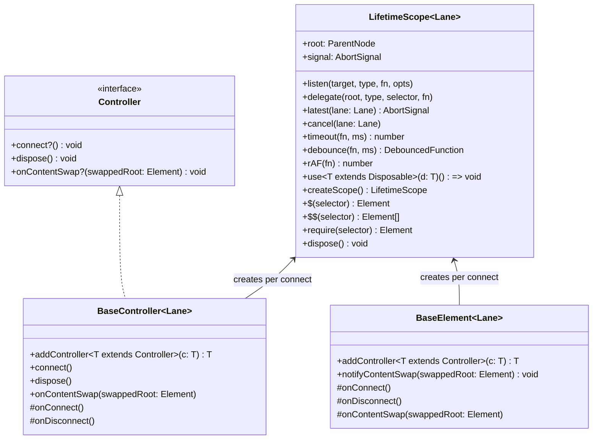

# UI V2 Client Micro-Framework Proposal (`LifetimeScope`, `BaseController`, & Lifecycle Hardening)

This document proposes a focused, dependency-free evolution of UI V2's client-side foundation (`src/web/v2/core/`). It is a companion to [FRONTEND_AUDIT.md](FRONTEND_AUDIT.md) and incorporates findings from two rounds of technical design review and a full inventory of the 41 `*.client.ts` modules (19 in `core/`, 10 registered custom elements).

---

## 1. Executive Summary & Scope Decision

UI V2 is an **SSR-first, Zero-JS Light DOM** architecture where the server (`*.server.ts`) renders the HTML structure, content updates swap server-rendered `SafeHtml` subtrees via `setHtml()` / `replaceWithHtml()` / `fetchAndSwapPartial()`, and client Custom Elements (`BaseElement`) act as behavioral islands.

An empirical survey of our 41 `*.client.ts` modules revealed a clear pattern: **almost every defect in the client codebase today is a lifecycle/ownership, content-swap, or server↔client selector drift bug, whereas only one (`dict_settings.client.ts`) is a state-fan-out bug:**

1. **Three dead client features caused by unverified server↔client selector removal**:
   - `#reader-breadcrumb-btn` ([`reader_toc.client.ts:132-140`](reader/reader_toc.client.ts)), `#reader-toc-back-btn` ([`L154-163`](reader/reader_toc.client.ts)), and `#reader-toc-filter` + `filter()` ([`L166-171`](reader/reader_toc.client.ts)) are bound by `ReaderTocController` and tested against hand-written fixtures in `reader_toc.test.ts`, **but are never rendered by any `*.server.ts` template** (`reader.test.ts:431-432` explicitly asserts the server omits the back button and filter).
   - Because `#reader-breadcrumb-btn` is never rendered, `ReaderTocController.open()`'s missing re-entrancy guard ([`reader_toc.client.ts:284-299`](reader/reader_toc.client.ts), which unconditionally adds `window` `resize` + `scroll` into `openDisposables` when `open()` is called directly) is currently a **latent defect** rather than reachable in production (`toggle()` guards via `isOpen()`).
2. **`MorcusReaderSettings` has a broken TOC mutual-exclusion fallback** ([`reader_settings.client.ts:188-197`](reader/reader_settings.client.ts)) that mutates `[hidden]` directly on `#reader-toc-drawer` instead of calling `tocController.close()` whenever `getTocController()` returns `null`.
3. **`ReaderPanelController.showTranslationError()` leaks retry listeners** ([`reader_panel.client.ts:494-503`](reader/reader_panel.client.ts)), attaching an untracked `click` listener outside `DisposableBag` on every retry.
4. **Constructor-bound controllers lose state on reconnect**: All four DOM sub-controllers (`ReaderTocController`, `ReaderPanelController`, `ReaderLayoutController`, `DrawerController`) register listeners in their `constructor()` and are destroyed and re-instantiated on every reconnect—discarding `_activeTab`, `isTranslationLoaded`, and `preferredDvh` (including across mobile/desktop media-query crossings in [`dict_toc.client.ts:45-72`](dict/dict_toc.client.ts)).
5. **Detached DOM reference bug across partial page swaps**: `ReaderPanelController` caches ~15 DOM references in its constructor ([`L73-94`](reader/reader_panel.client.ts)), including `notesOriginalParent` and `aboutOriginalParent`. After `swapPage()` replaces the `.reader-text-panel` subtree underneath the still-connected `<morcus-reader-view>`, those cached parents are detached, causing `destroy()` to skip reinsertion and `viewsContainer.remove()` to delete the notes/about subtrees outright.

### Architectural Verdict

- **Proceed immediately with Part 1 (`LifetimeScope` / `BaseController` / `addController` / `use`) and Part 2 (`AnchoredPopoverController`, Sink-Driven `onContentSwap`, & Selector Contract Tests).** Part 2's consolidation of the ~185-line popover block in `MorcusReaderSettings` (L176–362 of the 562-line file) and the ~160-line popover block in `ReaderTocController` (L186–345 of the 371-line file, after deleting dead breadcrumb/back/filter handlers) requires **only Part 1**, not a reactive signals engine.
- **Defer Part 3 (Reactive Signals Engine)** until Parts 1 and 2 have landed. A custom ~90-line depth-sorted push scheduler glitches on dynamic conditional dependency graphs (`if (!open) return;`), so if reactivity is still desired after lifecycle hardening, we will choose between a **~25-line depth-1 `Observable<T>` (`this.watch`)** or **`@preact/signals-core`** (1.4 kB gzip).

---

## 2. Part 1: `LifetimeScope`, `BaseController<Lane>`, & Ownership Contracts

### A. Split `addController(c)` (Host-Lifetime) from `use(cleanup)` (Scope-Lifetime)

A child controller owned by an element has a **different lifetime** from a disposable cleanup registered during a single connection or popover-open cycle. We separate them into two explicit primitives (mirroring Lit's `ReactiveController` protocol):

```ts
/**
 * 1. Long-lived sub-controller attached to a BaseElement (or parent BaseController).
 * Registered once (typically as a class field); survives across disconnect/reconnect
 * cycles so controller state (_activeTab, preferredDvh) is preserved while listeners
 * are cleanly torn down and re-registered on each cycle.
 */
export interface Controller {
  connect?(): void;
  dispose(): void;
  /** Optional hook invoked automatically by HTML sinks when a subtree inside the host is swapped. */
  onContentSwap?(swappedRoot: Element): void;
}

/**
 * 2. Single-use cleanup callback or disposable resource tied to a specific LifetimeScope.
 * Dies permanently when that scope is disposed (e.g. on disconnect or popover close).
 */
export type Disposable = (() => void) | { dispose(): void };
```

- **`this.addController<T extends Controller>(controller: T): T`** lives on **`BaseElement` and `BaseController`**. It registers `controller` in the host's permanent controller list. Whenever the host connects, it calls `controller.connect?.()`; whenever the host disconnects, it calls `controller.dispose()`.
- **`scope.use<T extends Disposable>(resource: T): () => void`** (and `this.use(resource)` on the active connect scope) registers a cleanup that runs when the current `LifetimeScope` is disposed, and returns an `unregister()` handle so child scopes can detach themselves cleanly before parent disposal.

> [!IMPORTANT] > **Unify `.destroy()` $\rightarrow$ `.dispose()` in a single commit.**
> Do not maintain duck-typed `{ dispose(): void } | { destroy(): void }` dual protocols. Rename `.destroy()` to `.dispose()` across `DrawerController`, `ReaderLayoutController`, `ReaderPanelController`, and `ReaderTocController` in one atomic commit.

### B. One-Shot `LifetimeScope` & Bounded Child Scopes (`createScope()`)

`DisposableBag` is reusable after `dispose()`, whereas `AbortController` is one-shot. `LifetimeScope<Lane>` resolves this by being **explicitly one-shot**:

- When `BaseElement.connectedCallback()` (or `BaseController.connect()`) runs, it creates a fresh active `LifetimeScope` (with a fresh `AbortController`).
- When `disconnectedCallback()` (or `dispose()`) runs, it disposes that `LifetimeScope` and drops it. This eliminates the `if (this.lifetime.signal.aborted)` special case in `BaseElement`.

**Preventing Parent-Bag Accumulation in `createScope()`:**
When a controller creates a child scope for transient "while-open" listeners (`const openScope = this.createScope()`):

1. `DisposableBag.add(fn)` returns an `unregister: () => void` function that removes `fn` from the bag.
2. `openScope` registers with its parent scope via `const detach = parentScope.use(() => openScope.dispose())`. When `openScope.dispose()` is called directly on popover close, it immediately invokes `detach()`, removing the dead `openScope` from `parentScope` so repeated open/close cycles are strictly $O(1)$ in memory.



### C. Capabilities Propagated to `BaseController<Lane>` & `BaseElement<Lane>`

| Capability                                                                                                       | Design & Guardrails                                                                                                                                                                                                                                                                                                                                                          |
| :--------------------------------------------------------------------------------------------------------------- | :--------------------------------------------------------------------------------------------------------------------------------------------------------------------------------------------------------------------------------------------------------------------------------------------------------------------------------------------------------------------------- |
| **1. `this.timeout(fn, ms)`, `this.debounce(fn, ms)`, & `this.rAF(fn)`**                                         | Automatically clears pending `setTimeout`, `requestAnimationFrame`, and debounced functions when the scope disposes. Fixes 7 unmanaged `setTimeout`s and 4 unmanaged `rAF`s across `report_dialog.client.ts`, `dict_search.client.ts`, and `reader_view.client.ts`.                                                                                                          |
| **2. `addController(c)` (Instance Reuse Across Reconnects)**                                                     | Controllers are instantiated once as fields (`private readonly toc = this.addController(new ReaderTocController(this));`) with inert constructors. Moving an element in the DOM (`reattach_conformance.test.ts`) or crossing a media query preserves controller state (`_activeTab`, `isTranslationLoaded`, `preferredDvh`) while re-binding DOM listeners in `onConnect()`. |
| **3. Nullable `this.listen(el \| null, ...)` + `this.require<T>(selector)` + Declared Selector Inventory Tests** | `this.listen` accepts `EventTarget \| null \| undefined` as a quiet no-op for genuinely conditional SSR controls (such as `#toggle-macra`), while mandatory elements use `this.require<T>(selector)` and **Declared Selector Inventory Contract Tests** (see §3.C) enforce that every selector appears in at least one server scenario.                                      |
| **4. Async Lifetime (`this.signal`, `this.latest(lane)`)**                                                       | Sub-controllers gain `AbortSignal` lanes so async operations like `ReaderPanelController`'s translation fetch abort cleanly on disconnect.                                                                                                                                                                                                                                   |

---

## 3. Part 2: `AnchoredPopoverController`, Sink-Driven `onContentSwap`, & Contract Tests

### A. `AnchoredPopoverController` (`core/popover.client.ts`)

Built on `BaseController` with a private `_isOpen: boolean` and a private `sync()` method, `AnchoredPopoverController` consolidates the popover/focus-trap logic across `MorcusReaderSettings` and `ReaderTocController`:

1. **Preserves `bindDismissable` Focus Semantics**:
   - `bindDismissable` (`core/dismissable.client.ts:48-54`) already focuses `triggerEl` **only on `Escape`**, not on outside-click (so clicking a passage word to dismiss the settings popover does not yank focus back to the settings button).
   - `AnchoredPopoverController` passes `container: panel`, `triggerEl: trigger`, `isOpen: () => this._isOpen`, `ignore: (t) => trigger.contains(t)`, and `onDismiss: () => this.close()` directly to `bindDismissable`.
2. **Clean Reset on Disconnect (`this.close()` in `onDisconnect`)**:
   - `onDisconnect()` calls `this.close()` (not just `this._isOpen = false`), ensuring that if an open popover is disconnected and reattached, `panel.hidden`, `backdrop.hidden`, and `aria-expanded="false"` are reset in the DOM rather than reattaching visually open with no listeners.
3. **Grouped Mutual Exclusion via `ownerDocument`**:
   - Dispatches `morcus:popover-will-open` on `this.host.ownerDocument` **before** mutating the DOM, carrying `{ source: this, group: this.group }` (e.g., `group: "reader-chrome"`).
   - Only popovers sharing the same non-empty `group` close when another opens, preserving support for independent or nested popovers (`abbr_popover`).

```ts
export class AnchoredPopoverController extends BaseController {
  private _isOpen = false;
  private openScope: LifetimeScope | null = null;
  private readonly group?: string;

  get isOpen(): boolean {
    return this._isOpen;
  }

  open(): void {
    if (this._isOpen) return;
    const doc = this.host.ownerDocument;
    if (this.group) {
      doc.dispatchEvent(
        new CustomEvent("morcus:popover-will-open", {
          detail: { source: this, group: this.group },
        })
      );
    }
    this._isOpen = true;
    this.sync();
  }

  close(): void {
    if (!this._isOpen) return;
    this._isOpen = false;
    this.sync();
  }

  protected override onDisconnect(): void {
    this.close();
  }

  private sync(): void {
    const panel = this.getPanel();
    const trigger = this.getTrigger();
    const backdrop = this.getBackdrop();
    if (panel) {
      assertConnected(panel);
      panel.hidden = !this._isOpen;
    }
    if (backdrop) {
      assertConnected(backdrop);
      backdrop.hidden = !this._isOpen;
    }
    if (trigger) {
      assertConnected(trigger);
      trigger.setAttribute("aria-expanded", String(this._isOpen));
    }

    this.openScope?.dispose();
    this.openScope = null;
    if (!this._isOpen || !panel || !trigger) return;

    const doc = this.host.ownerDocument;
    this.updatePosition(trigger, panel);
    const scope = (this.openScope = this.createScope());
    scope.listen(window, "resize", () => this.updatePosition(trigger, panel));
    scope.listen(window, "scroll", () => this.updatePosition(trigger, panel), {
      passive: true,
    });
    if (this.group) {
      scope.listen<CustomEvent<{ source: unknown; group?: string }>>(
        doc,
        "morcus:popover-will-open",
        (e) => {
          if (e.detail.group === this.group && e.detail.source !== this) {
            this.close();
          }
        }
      );
    }
    scope.use(
      bindDismissable({
        container: panel,
        triggerEl: trigger,
        isOpen: () => this._isOpen,
        ignore: (target) => trigger.contains(target),
        onDismiss: () => this.close(),
      })
    );
    scope.use(trapFocus(panel));
  }
}
```

### B. Modeling the Third Lifecycle: Sink-Driven `onContentSwap(swappedRoot)` & `assertConnected`

To make stale DOM references across partial page swaps (`swapPage()`, `fetchAndSwapPartial()`) impossible to ignore or forget:

1. **Trigger `notifyContentSwap(swappedRoot)` Inside the HTML Sinks, Not Call Sites**:
   - `setHtml`, `replaceWithHtml`, and `fetchAndSwapPartial` (`core/dom.client.ts` & `core/partial.client.ts`) are already the single ESLint-enforced choke points for HTML updates.
   - Whenever an HTML sink mutates `container`, it automatically walks up `container`'s ancestors and invokes `host.notifyContentSwap(container)` on any enclosing `BaseElement`, which forwards `onContentSwap(container)` to all registered controllers. Callers never have to remember to invoke `notifyContentSwap()` manually.
2. **Pass `swappedRoot: Element` to `onContentSwap(swappedRoot: Element)`**:
   - Controllers inspect `swappedRoot` to see if the swap affected their domain (e.g., `ReaderPanelController` only re-runs notes/about adoption when `swappedRoot` contains or is `.reader-text-panel`).
3. **Delete `notesOriginalParent` / `aboutOriginalParent`**:
   - Restoring adopted DOM nodes to a parent captured at construction cannot be made valid across partial swaps. `ReaderPanelController` will stop caching `notesOriginalParent` / `aboutOriginalParent` and instead re-query the live container if needed or simply discard on swap.
4. **Enforce a Dev-Only `assertConnected(el)` Invariant on DOM Writes**:
   - Rather than relying solely on convention to distinguish "static shell chrome" from "swapped content subtrees" (which breaks if a template later moves a popover inside a swapped container), DOM write helpers (`sync()`, `updatePosition()`) call a dev-only `assertConnected(el)` (`if (!el.isConnected) console.error(...)`). Unlike `listen(null)`, writing to a detached element has **zero false positives**—it is always a bug.

### C. Hardening the Test Safety Net Before Refactoring

1. **Declared Selector Inventory & Zero-Scenario Failure Rule**:
   - Simply asserting `require()` selectors leaves optional/conditional selectors unchecked—which is how `#reader-breadcrumb-btn`, `#reader-toc-back-btn`, and `#reader-toc-filter` became dead code when the server stopped rendering them.
   - Each slice declares an explicit selector inventory enumerating which server scenarios render each selector:
     ```ts
     export const READER_SELECTORS = {
       tocDrawer: { id: "reader-toc-drawer", requiredIn: ["work-page"] },
       tocBtn: { id: "reader-toc-btn", requiredIn: ["work-page"] },
       toggleMacra: { id: "toggle-macra", optionalIn: ["work-with-macra"] },
     } as const;
     ```
   - **Contract Test Invariant**: Every declared selector must resolve in all its `requiredIn` scenarios AND in all its named `optionalIn` scenarios—and **any selector bound by the client that resolves in zero server scenarios fails the test**.
2. **Expand `reattach_conformance.test.ts` Fixtures & Open-State Reattach**:
   - Add `#reader-toc-drawer`, `#reader-toc-btn`, and `.reader-splitter` to the `"morcus-reader-view"` fixture in [`core/reattach_conformance.test.ts`](core/reattach_conformance.test.ts) (L128–152) so `ReaderTocController` and `ReaderLayoutController` don't early-return.
   - Add an open-popover reattach test that opens `morcus-reader-settings` / `ReaderTocController`, moves the host element in the DOM, and asserts that the popover closes cleanly (`hidden === true`, `aria-expanded === "false"`) and re-binds its trigger listener.
   - Add nested `DisposableBag` / `LifetimeScope` `unregister()` tests in `disposable.test.ts`.

---

## 4. Part 3: Post-Lifecycle Reactivity Evaluation (Closed — No Reactive Primitive Needed)

With Steps 1–5 complete and `MorcusDictSettings` unified around `syncUi()`, `this.delegate()`, and `this.emit()`, we re-evaluated whether any remaining state-synchronization code in `src/web/v2/` warrants introducing a ~25-line `Observable<T>` (`this.watch`) or `@preact/signals-core`:

1. **Zero multi-hop derived state graphs (`computed()`) exist in `src/web/v2/`**: All state in UI V2 is flat view/controller state (`_isOpen`, `_activeTab`, `preferredDvh`, `currentPrefs`, `activeDictKeys`) rendered directly to DOM attributes/properties via single-pass `sync()` / `syncUi()` methods.
2. **Cross-component state fan-out is already cleanly handled by standard bubbling DOM `CustomEvent`s (`this.emit()` + `this.listen()`)**:
   - `<morcus-reader-settings>` $\rightarrow$ `<morcus-reader-view>` (`reader-settings-change`)
   - `<morcus-dict-settings>` $\rightarrow$ `<morcus-dict-search>` (`dict-selection-change`, `dict-inflected-change`)
   - Peer popovers (`AnchoredPopoverController` via `morcus:popover-will-open` on `ownerDocument`)
     Because the settings islands live inside the host custom elements they configure, standard bubbling DOM events connect them with automatic `LifetimeScope` disposal on disconnect—without global singleton stores or listener-leak risks.
3. **Verdict**: **Do not add `Observable<T>` or `@preact/signals-core`.** `BaseElement` + `BaseController` + `LifetimeScope` + explicit `sync()` methods completely resolve the lifecycle and state-synchronization pain while keeping a single, standard DOM event model across all 41 client modules.

---

## 5. Sequenced Implementation Plan (Completed)

- [x] **Step 1 — Managed Timers (`this.timeout`, `this.debounce`, `this.rAF`)** (🟢)
  - Landed on `BaseElement` / `LifetimeScope` and migrated unmanaged `setTimeout` / `rAF` call sites (`report_dialog.client.ts`, `dict_search.client.ts`, `reader_view.client.ts`).
- [x] **Step 2 — Selector Inventory Contract Test & Expanded `reattach_conformance.test.ts`** (🟢)
  - Added `reader_selector_contract.test.ts` verifying all reader selectors across server scenarios and deleted dead `#reader-breadcrumb-btn`, `#reader-toc-back-btn`, and `#reader-toc-filter` handlers.
  - Expanded `reattach_conformance.test.ts` fixtures (`#reader-toc-drawer`, `#reader-toc-btn`, `.reader-splitter`, plus open-before-move popover assertions) and added `unregister()` tests to `disposable.test.ts`.
- [x] **Step 3 — `LifetimeScope` + `BaseController` + `addController(c)` / `use(cleanup)`** (🟡)
  - Unified `.destroy()` $\rightarrow$ `.dispose()` across `DrawerController`, `ReaderLayoutController`, `ReaderPanelController`, and `ReaderTocController`.
  - Extracted one-shot per-connect `LifetimeScope` and `BaseController<Lane>` in `core/base_element.client.ts`.
  - Migrated `ReaderTocController` as the proof case.
- [x] **Step 4 — `AnchoredPopoverController` (`core/popover.client.ts`)** (🟡)
  - Extracted `AnchoredPopoverController` + `trapFocus` with `bindDismissable` focus semantics, `close()` on disconnect, `assertConnected()`, and grouped `morcus:popover-will-open` mutual exclusion.
  - Refactored `MorcusReaderSettings` and `ReaderTocController` to use `AnchoredPopoverController`, deleting `getTocController()` and the `#reader-toc-drawer[hidden]` DOM-poking fallback.
- [x] **Step 5 — Sink-Driven `onContentSwap(swappedRoot)` & Remaining Controllers** (🟡)
  - Wired automatic `notifyContentSwap(container)` into `setHtml` / `replaceWithHtml` / `fetchAndSwapPartial`.
  - Updated `ReaderPanelController` to implement `onContentSwap(swappedRoot)`, deleted `notesOriginalParent` / `aboutOriginalParent`, and fixed the retry listener leak in `showTranslationError()`.
  - Migrated `DrawerController` and `ReaderLayoutController` to `BaseController` + `addController()`.
- [x] **Step 6 — Re-evaluate Reactivity** (🟢)
  - Refactored `MorcusDictSettings` to use `syncUi()`, `this.delegate()`, `this.emit()`, and `this.use()`. Confirmed that `BaseController` + explicit `sync()` / `syncUi()` methods and bubbling DOM `CustomEvent`s eliminate any need for a separate reactive `Observable<T>` or signals primitive.
- [x] **Step 7 — Collapse Forwarder Duplication into `LifetimeScope`** (🟡)

  - Exposed `protected get scope(): LifetimeScope<Lane>` on `BaseElement` and `BaseController`, backed by a `DEAD_SCOPE` singleton when disconnected, and deleted ~30 forwarding methods that existed in triplicate.
  - Extracted `createDurableDebounce()` as a single shared helper so a debounced function declared as a `readonly` class field keeps working across disconnect/reconnect cycles (pending work still cancels on disconnect).
  - Kept `LifetimeScope.$` / `.$$` **ungated**: DOM reads must succeed during teardown, so they are deliberately not tied to disposal state.
  - Aligned `BaseElement.disconnectedCallback()` to run `onDisconnect()` _before_ disposing the scope, matching `BaseController.dispose()`.

  > [!IMPORTANT] > **API change:** §2 and §3 above describe the pre-Step-7 surface (`this.listen(...)`, `this.use(...)`, `this.$(...)`, `this.createScope()`). These now live on the scope: **`this.scope.listen(...)`, `this.scope.use(...)`, `this.scope.$(...)`, `this.scope.createScope()`**. Still on the host itself: `addController()`, `emit()`, `hijackForm()`, `syncQueryParam()`, and `debounce()`.

  > [!NOTE] > **On bundle size:** this refactor was originally motivated by an estimate that the triplicated forwarders cost ~1 kB gzipped. That estimate was wrong by roughly two orders of magnitude. Measured outcome: **−511 B raw / −27 B gzip.** Two reasons, both worth remembering before optimizing for bundle size again:
  >
  > 1. **Gzip already deduplicates repetition.** Three byte-identical copies of `debounce` measured 470 B raw but only **7 B gzipped** — repetition inside DEFLATE's 32 kB window is ~98.5% free. Only _distinct_ tokens cost.
  > 2. **Removing an abstraction relocates its cost to call sites.** Deleting the forwarders added 161 `this.scope.*` call sites × 6 unmangled bytes = +966 B raw, against ~1,372 B of forwarders removed.
  >
  > Step 7 is worth keeping on **design** grounds — one implementation per primitive, ~15 null-guards eliminated, and lifetime made visible at the call site. Do not repeat it expecting bytes.

---

## 6. Post-Implementation Review: Outstanding Follow-Ups

A review of the landed implementation confirmed all five defects in §1 are fixed and pinned by tests. The items below were identified during that review and are **not yet done**. They are ordered by value, not by effort.

### 6.1 Restore exception safety in teardown (🟢 small, introduced by Step 7)

`onDisconnect()` now runs _before_ the scope is disposed in both `BaseElement.disconnectedCallback()` and `BaseController.dispose()`. That ordering is correct, but it means a throw inside `onDisconnect()` skips `_scope.dispose()` entirely and leaks every listener:

```ts
for (const controller of this.controllers) {
  controller.dispose();
}
this.onDisconnect(); // throws here...
this._scope?.dispose(); // ...and this never runs
```

- [x] Wrap both teardown paths in `try { ... } finally { this._scope?.dispose(); this._scope = null; }`.
- [x] Consider the same isolation for the `controller.dispose()` loop — one throwing child currently aborts the rest. `DisposableBag.dispose()` already does per-callback error isolation, so this is the codebase's established standard.

This matters because `ReaderPanelController.onDisconnect()` performs real DOM surgery (`insertBefore` can throw `NotFoundError`).

### 6.2 Connect hosts before their child controllers (🟡)

`BaseController.connect()` and `BaseElement.connectedCallback()` both run `controller.connect?.()` for every child **before** `this.onConnect()`. A host therefore cannot resolve its own elements before its children ask for them.

This already forced a workaround: `ReaderTocController` calls `this.resolveElements()` from inside its `getPanel()` callback, and `getTrigger()` silently depends on `getPanel()` having run first in the same `sync()` pass.

- [x] Run `this.onConnect()` before connecting child controllers, and remove the `resolveElements()`-inside-`getPanel()` workaround in `reader_toc.client.ts`.

### 6.3 Move `assertConnected` into the HTML sinks (🟢)

§3.B.4 specified this for "DOM write helpers", but it only landed in `popover.client.ts` (5 call sites, `sync()` and `updatePosition()`). The ESLint-enforced choke points are where the detached-write bug class actually lives.

- [ ] Call `assertConnected(target)` from `setHtml`, `replaceWithHtml` (`core/dom.client.ts`) and `swapElementContent` (`core/partial.client.ts`).
- [ ] Known detached-write path to verify: `ReaderPanelController.setTab()` writes into `this.translationView` from a `.then()`. The `latest("translation")` abort lane covers the network path, but a **cache hit** in `MorcusReaderView.translationCache` resolves without consulting the signal.

### 6.4 Widen the selector inventory contract test (🟡)

`reader_selector_contract.test.ts` is the guard against the dead-selector class that produced three dead features. It currently covers less than it appears to:

- [ ] Scan more than `reader_toc.client.ts` + `reader_settings.client.ts` — `reader_view.client.ts` alone binds ~32 selectors and is unscanned, as are `reader_panel`, `drawer`, and every `dict_*` module.
- [ ] Match `this.scope.require(...)` — the extractor regex misses it.
- [ ] Match delegated selectors — the 3rd argument of `delegate(root, type, selector, fn)` (e.g. `#btn-retry-translation`) is invisible today.
- [ ] Stop skipping comma-containing selectors (`if (!raw.includes(","))`), which silently exempts real bindings such as `#toggle-inflected, .inflected-checkbox`.

### 6.5 Disambiguate the two `() => void` conventions (🟢)

Two opposite meanings currently share one type, one keystroke apart at the call site:

| Returns an **unregister** handle             | Returns a **run-cleanup** handle                         |
| :------------------------------------------- | :------------------------------------------------------- |
| `DisposableBag.add()`, `LifetimeScope.use()` | `bindDismissable()`, `trapFocus()`, `trackPointerDrag()` |

Nothing depends on the ambiguity today (`DisposableBag.add` was changed from returning the callback itself, and no caller captured the old value), but the next person to capture one will get the wrong one silently.

- [ ] Introduce distinct named types (`Unregister` vs `Dispose`), or rename the methods.

### 6.6 Finish the popover consolidation, or document why not (🟡)

Two hand-rolled popovers remain — exactly the pattern §3.A was built to delete:

- [ ] `MorcusDictSettings` keeps its own `isOpen` field _and_ reads `detailsEl.open` — two sources of truth synchronized by a `toggle` listener — plus a bespoke `closeSettingsPopover()`.
- [ ] `abbr_popover.client.ts` still binds `click` + `pointerdown` + `keydown` + `resize` on `document`/`window` by hand.

If the `<details>`-based one genuinely cannot fit `AnchoredPopoverController`, record that in a comment; it currently reads as an unfinished migration.

### 6.7 Get the test environment out of the shipped bundle (🟢)

- [ ] `trapFocus` branches on `navigator.userAgent.includes("jsdom")` at runtime, in production code (`core/popover.client.ts`).
- [ ] `trapFocus` **and** `bindDismissable` both register `keydown` on `document` _and_ `window`. Since keydown bubbles `document → window`, each handler runs twice per keypress in a real browser. Both are currently saved by guards (`e.defaultPrevented`, an `isOpen()` re-check) — load-bearing accident rather than design.

A jsdom-side shim in the test setup, or the existing injected-option pattern (`defaultWidth`), is cleaner than either.

### 6.8 Migrate the last raw listener block (🟢)

- [ ] `MorcusReaderView.initBackToTop()` still uses raw `addEventListener` with a hand-written `addDisposable` teardown. It is correct, just off-pattern — and off-pattern is how the `showTranslationError()` listener leak (§1.3) happened.
