# UI V2 (Progressive Enhancement Architecture)

## Overview

The UI V2 prototype explores a server-rendered Multi-Page Application (MPA) model as an alternative to the existing Single-Page Application (SPA) + JSON-RPC architecture.

### Core Principles

1. **Zero-JS Baseline**: All primary user flows (dictionary lookup, inflected search, site navigation, and readability) function 100% without client-side JavaScript using standard HTML semantics (`<form method="GET">`, native `<details>`/`<summary>`, and semantic `<a>` links).
2. **Light DOM Custom Elements (Zero Framework Overhead)**: Web Components extend native `HTMLElement` to wrap server-rendered markup without shadow root barriers or form association issues, keeping client bundle size minimal (<15 KB).
3. **Safe DOM Manipulation**: Components use safe DOM APIs (`textContent`, `replaceChildren`, and `createContextualFragment`) with event delegation for performant, robust updates and automated XSS protection.
4. **Coexistence**: Mounted under `/v2/*`, leaving the existing React/Preact SPA, RPC endpoints, and build pipelines completely unaffected.

---

## Architecture & Directory Layout

```
src/web/v2/
├── shell/                                # Document skeleton, app bar, theme & design tokens
│   ├── page_shell.server.ts              # Document skeleton (<head>, <body>, inline scripts/styles)
│   ├── app_bar.server.ts                 # Persistent accessible navigation bar markup
│   ├── asset_manifest.server.ts          # Content-hashed asset mapping for SSR
│   ├── theme_toggle.client.ts            # Light/dark mode Web Component (<morcus-theme-toggle>)
│   ├── critical_theme.client.ts          # Inlined anti-flash theme script (runs in <head>)
│   ├── app_bar.css                       # Header & navigation bar layout
│   ├── variables.css                     # Theme design tokens & CSS custom properties
│   └── critical_variables.css            # Above-the-fold critical variables
├── dict/                                 # Dictionary lookup, search, inflections & settings
│   ├── dict_page.server.ts               # Full dictionary SSR page generator
│   ├── dict.server.ts                    # Clean facade re-exporting dict SSR functions
│   ├── entry_view.server.ts              # Lexicon cards, entry headers & inflections SSR
│   ├── search_bar.server.ts              # Search form & settings button HTML generator
│   ├── xml_to_html.server.ts             # TEI XML AST to HTML string transformer
│   ├── linkify.server.ts                 # Latin word tokenization & linkification utility
│   ├── dict_search.client.ts             # Form hijack, keyboard nav & history sync (<form is="morcus-dict-search">)
│   ├── dict_settings.client.ts           # Highlight settings popover & slider (<morcus-dict-settings>)
│   ├── dict_suggestions.client.ts        # Autocomplete dropdown component (<morcus-dict-suggestions>)
│   ├── dictionary.css                    # Lexicon entries, citations & word definitions styling
│   ├── search.css                        # Search bar, input, and suggestions dropdown styling
│   ├── dict_settings.css                 # Settings button, slider, and popover styling
│   ├── dict.test.ts                      # SSR & entry rendering unit tests
│   ├── search_bar.test.ts                # Search bar form generation unit tests
│   └── dict_settings.test.ts             # Client settings component unit tests
├── reader/                               # Parallel two-column reader
│   ├── reader.server.ts                  # Reader page SSR template
│   ├── reader_view.client.ts             # Fragment swapping & scroll sync Web Component (<morcus-reader-view>)
│   ├── reader.css                        # Two-column layout, line numbers & typography
│   └── reader.test.ts                    # Reader SSR unit tests
├── dialog/                               # Accessible modal dialogs & feedback reporting
│   ├── dialog.server.ts                  # Native <dialog> HTML markup generator
│   ├── report_dialog.client.ts           # Client AJAX feedback modal Web Component (<morcus-report-dialog>)
│   ├── dialog.css                        # Native <dialog> backdrop & modal styling
│   └── dialog.test.ts                    # Dialog markup unit tests
├── about/                                # Static documentation & project info
│   ├── about.server.ts                   # About page SSR template
│   ├── about.css                         # About page typography & section styles
│   └── about.test.ts                     # About page unit tests
├── v2_router.ts                          # Express router orchestrator mounted at /v2 (public API)
├── v2_router.test.ts                     # Router endpoint integration tests
├── v2_bundle.ts                          # Rsbuild client entry point (aggregates all *.client.ts)
├── v2.css                                # Global CSS entry point (aggregates topic stylesheets)
├── v2-critical.css                       # Above-the-fold critical CSS (inlined in <head>)
├── README.md                             # Architectural overview & design rules
└── TESTING.md                            # Testing guide (Jest & Playwright E2E)
```

### Build Pipeline

- **Bundler script**: [src/bundler/v2.rsbuild.ts](src/bundler/v2.rsbuild.ts)
- **Output bundle**: `build/v2/v2.js` (ESM module loaded via `<script type="module" src="/v2/assets/v2.js">`)
- **Stylesheet**: `src/web/v2/v2.css` served statically at `/v2/assets/v2.css`

---

## Data Flow & Request Lifecycle

```mermaid
sequenceDiagram
    autonumber
    actor User as Browser / User
    participant Router as Express (/v2/dicts)
    participant Fused as FusedDictionary (Server)
    participant Lit as Lit Web Components (Client)

    alt Initial Load / No-JS Form Submit
        User->>Router: GET /v2/dicts?q=habeo
        Router->>Fused: getEntry({ query: "habeo", mode: 1 })
        Fused-->>Router: DictsFusedResponse
        Router-->>User: 200 OK (Full SSR HTML document with <details>, app bar)
    else With JS: Live Autocomplete
        User->>Lit: Type "hab" into <input name="q">
        Lit->>Router: GET /v2/api/completions?q=hab
        Router->>Fused: getCompletions("hab")
        Fused-->>Router: string[]
        Router-->>Lit: JSON string[]
        Lit-->>User: Declarative <morcus-dict-suggestions> dropdown
    else With JS: Form Hijack (AJAX Swap)
        User->>Lit: Submit form / select suggestion
        Lit->>Router: GET /v2/dicts?q=habeo&format=partial (X-Requested-With: fetch)
        Router->>Fused: getEntry({ query: "habeo", mode: 1 })
        Router-->>Lit: HTML fragment (<details class="v2-dict-card">...)
        Lit->>User: replaceChildren(fragment) & history.pushState()
    end
```



---

## Theme Switching Model

- **No-JS**: Media query `@media (prefers-color-scheme: dark)` adapts colors automatically based on the user's OS preference. Interactive custom elements (`morcus-theme-toggle` and `morcus-report-dialog`) are hidden using `:not(:defined) { display: none; }` so no dead controls are shown to users without JavaScript.
- **With JS**: `<morcus-theme-toggle>` and `<morcus-report-dialog>` initialize and display buttons in the app bar. Theme selection toggles `[data-theme="dark"]` / `[data-theme="light"]` on `document.documentElement` and persists to `localStorage.getItem("GlobalSettings")`. Feedback reporting opens via native `<dialog>` modal and submits via AJAX.
- **Zero Flicker**: An inline script in `<head>` executes before the first paint to apply the saved theme attribute immediately.

---

## Testing & Verification

Comprehensive instructions for running unit tests and Playwright E2E tests are detailed in [TESTING.md](TESTING.md).

- **E2E Tests**: `REUSE_DEV_SERVER=true PORT=1337 npx playwright test browser_v2_e2e`
- **Unit Tests**: `npx jest src/web/v2`
- **Type Checking**: `npx tsc --noEmit`
