# Dictionary Topic (`src/web/v2/dict/`)

## Overview

This directory encapsulates all server-side rendering and client-side web components for dictionary lookups, search bar interactions, morphological entry cards, XML AST transformation, and highlight settings.

---

## Data Flow & Request Lifecycle

```mermaid
sequenceDiagram
    autonumber
    actor User as Browser / User
    participant Router as Express (/v2/dicts)
    participant Fused as FusedDictionary (Server)
    participant Lit as Web Components (Client)

    alt Initial Load / No-JS Form Submit
        User->>Router: GET /v2/dicts?q=habeo
        Router->>Fused: getEntry({ query: "habeo", mode: 1 })
        Fused-->>Router: DictsFusedResponse
        Router-->>User: 200 OK (Full SSR HTML document with <details>, app bar)
    else With JS: Live Autocomplete
        User->>Lit: Type "hab" into <input name="q">
        Lit->>Router: GET /v2/api/completions?q=hab
        Router->>Fused: getCompletions("hab")
        Fused-->>Router: string[]
        Router-->>Lit: JSON string[]
        Lit-->>User: Declarative <morcus-dict-suggestions> dropdown
    else With JS: Form Hijack (AJAX Swap)
        User->>Lit: Submit form / select suggestion
        Lit->>Router: GET /v2/dicts?q=habeo&format=partial (X-Requested-With: fetch)
        Router->>Fused: getEntry({ query: "habeo", mode: 1 })
        Router-->>Lit: HTML fragment (<details class="v2-dict-card">...)
        Lit->>User: replaceChildren(fragment) & history.pushState()
    end
```

---

## Component Roles

- `dict_page.server.ts`: Generates the outer page shell and multi-lexicon containers.
- `entry_view.server.ts`: Renders entry headers, definition blocks, and inflection tables.
- `search_bar.server.ts`: Renders the accessible search `<form>`, input field, and action buttons.
- `xml_to_html.server.ts`: Safe transformer converting TEI XML AST nodes into sanitized HTML.
- `linkify.server.ts`: Tokenizes text and wraps Latin words in clickable search links.
- `dict_search.client.ts`: Custom element managing form hijacking, history pushes, and keyboard navigation.
- `dict_suggestions.client.ts`: Accessible dropdown list rendering live autocomplete suggestions.
- `dict_settings.client.ts`: Popover slider controlling highlight strength and theme accents.
