# Dictionary Topic (`src/web/v2/dict/`)

## Overview

This directory encapsulates all server-side rendering and client-side web components for dictionary lookups, search bar interactions, morphological entry cards, XML AST transformation, and highlight settings.

---

## Data Flow & Request Lifecycle

```mermaid
sequenceDiagram
    autonumber
    actor User as Browser / User
    participant Router as Express (/v2/dicts)
    participant Fused as FusedDictionary (Server)
    participant Lit as Web Components (Client)

    alt Initial Load / No-JS Form Submit
        User->>Router: GET /v2/dicts?q=habeo
        Router->>Fused: getEntry({ query: "habeo", mode: 1 })
        Fused-->>Router: DictsFusedResponse
        Router-->>User: 200 OK (Full SSR HTML document with <details>, app bar)
    else With JS: Live Autocomplete
        User->>Lit: Type "hab" into <input name="q">
        Lit->>Router: GET /v2/api/completions?q=hab
        Router->>Fused: getCompletions("hab")
        Fused-->>Router: string[]
        Router-->>Lit: JSON string[]
        Lit-->>User: Declarative <morcus-dict-suggestions> dropdown
    else With JS: Form Hijack (AJAX Swap)
        User->>Lit: Submit form / select suggestion
        Lit->>Router: GET /v2/dicts?q=habeo&format=partial (X-Requested-With: fetch)
        Router->>Fused: getEntry({ query: "habeo", mode: 1 })
        Router-->>Lit: HTML fragment (<details class="v2-dict-card">...)
        Lit->>User: replaceChildren(fragment) & history.pushState()
    end
```

---

## Component Roles

- `dict_page.server.ts`: Generates the outer page shell, transparency status pills (including zero-hit pills), and multi-lexicon containers.
- `dict_selection.server.ts`: Parses dictionary parameters from URL (`in=` or `dict=`), parses and formats functional UI cookies (`morcus_dicts=`), and resolves active dictionaries based on the precedence hierarchy and source language filters (`lang=La`).
- `entry_view.server.ts`: Renders entry headers, definition blocks, and inflection tables.
- `search_bar.server.ts`: Renders the accessible search `<form>`, input field, action buttons, and dictionary settings triggers.
- `xml_to_html.server.ts`: Safe transformer converting TEI XML AST nodes into sanitized HTML.
- `linkify.server.ts`: Tokenizes text and wraps Latin words in clickable search links.
- `dict_search.client.ts`: Custom element managing form hijacking, history pushes, keyboard navigation, and client-side Latin word progressive enhancement.
- `dict_suggestions.client.ts`: Accessible dropdown list rendering live autocomplete suggestions.
- `dict_settings.client.ts`: Popover controlling highlight strength, individual dictionary selection checkboxes, and `localStorage` / cookie synchronization.

---

## State Management & Precedence Architecture

The active dictionary selection follows a strict source-of-truth priority:

$$\text{URL Query Parameter (dict= / in=)} \succ \text{Functional Cookie (morcus\_dicts)} \succ \text{Default Preset (All Latin except Pozo)}$$

### 1. URL Parameter (`dict=` or `in=`)

- Highest precedence. Allows bookmarks, reader deep-links, and shared URLs to function deterministically.
- Supports comma- or hyphen-delimited keys (e.g. `?dict=L&S,GAF` or `?in=LnS-GAF`).

### 2. Cookie (`morcus_dicts`) vs `localStorage` (`SEARCH_SETTINGS_KEY`)

- **No-JS Baseline**: The server inspects the `morcus_dicts` cookie on SSR. When a user submits a form with a new dictionary selection, the server returns a `Set-Cookie` header with `SameSite=Lax; Path=/; Max-Age=1 year`.
- **Client (JS Enhanced)**: The client reads and writes the existing V1 key `SEARCH_SETTINGS_KEY = "SEARCH_SETTINGS_KEY"` in `localStorage`. When the user toggles a dictionary checkbox or preset in `<morcus-dict-settings>`, JS updates **both** `localStorage` and `document.cookie`.
- **Hydration Sync**: On initial client boot, if `localStorage` has saved preferences but the cookie is missing, client JS writes the cookie so subsequent direct SSR loads remain in sync.
- **Privacy & Compliance**: The cookie stores only functional UI preferences (e.g. `morcus_dicts=L%26S%3BGAF`). Under GDPR/ePrivacy and CCPA, it qualifies as an exempt **strictly necessary / user preference** cookie and requires no consent banner.

### 3. Query Language Constraints (`lang=La`) vs Layout (`embedded=1`)

- **`lang=La`** is strictly a search constraint: filters dictionaries down to those whose source language is Latin (`languages.from === "La" || "*"`).
  - Used automatically when words are clicked in the Latin Reader.
- **`embedded=1`** is strictly a presentation/layout constraint: hides the site app bar and footer when rendered inside an iframe or reader drawer.
  - Manual typing in an embedded search bar omits `lang` so users can freely search English-to-Latin (e.g. Smith & Hall) or German-to-Latin (Georges).

---

## Transparency & Zero-Hit Status

- The search result navigation bar displays pills for **all** queried dictionaries.
- Dictionaries with matches display active anchor jump links with their count: `<a href="#dict-L-S" class="v2-jump-pill">...</a>`.
- Dictionaries that returned 0 matches are transparently displayed as dashed pills: `...0`.
- If no dictionaries had matches, a summary line shows exactly which lexica were queried (e.g. `Searched: Lewis & Short, Gaffiot`).
