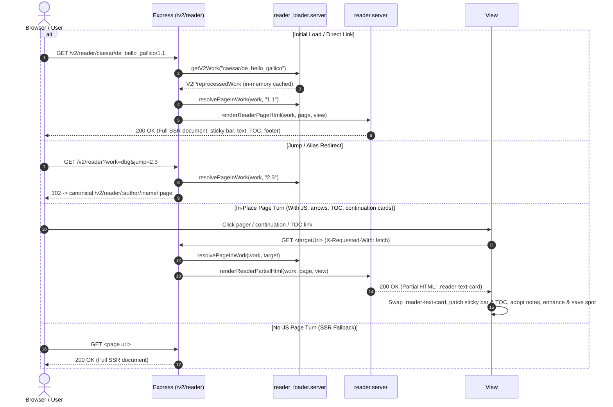

# Reader Topic (`src/web/v2/reader/`)

## Overview

This directory encapsulates all server-side rendering and client-side web components for the library reader: work/page loading, the citation-addressed text view, the sticky navigation bar, the table-of-contents drawer, reading preferences, the parallel translation view, and the embedded dictionary panel.

Companion docs: [`FEATURE_PARITY.md`](FEATURE_PARITY.md) tracks the V1 → V2 gap, and [`UX_STRUCTURE.md`](UX_STRUCTURE.md) records the surface model for the reader chrome — read it before adding anything to the top bar.

---

## Data Flow & Request Lifecycle

> [!NOTE]
> When JavaScript is active, page turns (pager arrows, continuation cards, TOC links) and browser history (popstate) perform fast in-place partial swaps (`X-Requested-With: fetch`), swapping only the `.reader-text-card` while dynamically patching sticky bar controls, updating the TOC, adopting footnotes into the dictionary panel, and saving reading progress without full-page reloads. Native `<a>` links ensure a robust zero-JS fallback.

---

## Component Roles

### Server

- `reader_routes.server.ts`: Registers `/reader/:author/:name/:page?` and the legacy `/reader?work=&jump=` entry point, handles alias/jump redirects to canonical URLs, and serves full pages or partials depending on `isPartialRequest`.
- `reader_loader.server.ts`: Reads preprocessed works from `LIB_DEFAULT_DIR`, transparently gunzips them, and caches works, slug→id mappings, and library summaries in memory. Also resolves a citation string to a concrete page.
- `reader.server.ts`: Renders the page shell — primary sticky navigation bar (TOC drawer launcher, pager controls, anchored `Aa` typography launcher, and Info launcher), passage text with citation gutters, parallel translation column, and the passage footer with continuation cards.
- `reader_toc.server.ts`: Renders the table of contents, including its `:target`-addressable No-JS fallback.
- `reader_dialogs.server.ts`: Renders the bibliography/provenance modal dialog and the anchored reader settings typography popover.
- `reader_types.server.ts`: Domain types for the citation hierarchy (`CitationId`, `ReaderSection`, `ReaderPage`, `ReaderWork`) supporting works of arbitrary citation depth.

### Client

- `reader_view.client.ts`: The main controller — partial navigation, section anchors, word lookup into the dictionary panel, dialog wiring, and keyboard shortcuts.
- `reader_toc.client.ts`: `ReaderTocController` — opens/closes the TOC drawer and applies the live filter.
- `reader_settings.client.ts`: `MorcusReaderSettings` — the anchored typography popover, persisting to `morcus_reader_settings` in `localStorage`.
- `reader_layout.client.ts`: `ReaderLayoutController` — the desktop resizable splitter and the mobile bottom drawer hosting the embedded dictionary.

### Styles

`reader_text.css` (passage body, citation gutters, and the TEI rendition classes), `reader_notes.css` (critical apparatus markers and footnotes), `reader_nav.css` (sticky bar), `reader_toc.css`, `reader_dialogs.css`, `reader_layout.css`, `reader_splitter.css`, `reader_dict.css`.

---

## Upstream Data Pipeline

The reader does **not** parse TEI at request time. Works are preprocessed offline:

1. [`process_work.ts`](../../../common/library/process_work.ts) parses the TEI source and hoists critical apparatus note bodies into a `notes` array, leaving positional markers in the tree.
2. [`v2_preprocessor.ts`](../../../common/library/v2/v2_preprocessor.ts) flattens the work into `V2PreprocessedWork` — pages of sections with pre-rendered HTML strings, plus metadata (author, editor, translation availability, `hasMacra`, license). It also resolves each note marker against that `notes` array, emitting a footnote link in the text and collecting the bodies the page referenced into `notesHtml`.
3. Output lands in `build/library_processed/`, indexed by `morcus_v2_index.json`, and is read by `reader_loader.server.ts`.

> [!IMPORTANT]
> Rendition semantics (verse lines, indentation, blockquotes, emphasis) are decided in step 2 and expressed as CSS classes on the emitted HTML. Fixing how text _looks_ therefore usually means editing `v2_preprocessor.ts`, `reader_text.css`, or both — see [`FEATURE_PARITY.md`](FEATURE_PARITY.md) §2.7.

---

## Testing

Unit tests live alongside the sources (`reader.test.ts`, `reader_view.test.ts`, `reader_toc.test.ts`, `reader_settings.test.ts`, `reader_layout.test.ts`) and run with `npm run ts-tests:v2`. Functional and visual browser coverage is described in [`../TESTING.md`](../TESTING.md).
